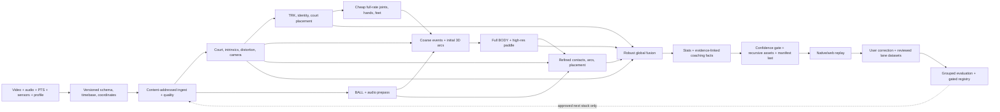

# DinkVision North Star

Last updated: 2026-07-17.
Status: `VERIFIED=0`.

## Authority and reading rule

This is the sole authority for:

- the product we are building;
- what is actually true today;
- the order of future work;
- promotion gates, stop rules, and the active agent queue.

If another narrative document conflicts with this file, this file wins. The
other active documents have narrower roles:

- `AGENTS.md`: durable repository rules and code navigation;
- `RUNBOOK.md`: commands, flags, actual stage order, artifacts, and failure diagnosis;
- `BALL_TRACKING_PIPELINE.md`: stable numbered BALL interface contract;
- `configs/racketsport/best_stack.json` and `models/MANIFEST.json`: selected defaults and checkpoint identity;
- `runs/`: dated evidence and history, never current truth merely because a file exists.

No root checklist, separate master plan, capability matrix, wave narrative, or
technical blueprint may become a second roadmap. Historical versions are
preserved under `runs/archive/root_docs_20260709/`.

## 1. The product

### 1.1 Promise

A player opens the iPhone app, records or imports one full pickleball game, and
receives the most accurate practical single-camera reconstruction we can make:

- synchronized original video and a metric 3D court;
- four persistent players with articulated 3D meshes;
- ball flight, bounces, contacts, landings, and in/out uncertainty;
- paddle pose at the moments where it can be supported;
- rally, shot, movement, positioning, and recovery facts;
- a short coaching plan whose claims jump back to the exact supporting moments.

The product must be fast enough to remain useful, but correctness and honesty
come before latency. Product inference is single-camera for v1 and assumes a
fixed, non-moving camera: court geometry is solved once and reused for the whole
clip. Moving-camera support is out of scope for v1. Extra cameras, markers, and
surveyed geometry are allowed for training and independent ground truth, not as
a hidden product requirement.

### 1.2 End-to-end user experience

| Step | User experience | Product requirement |
|---|---|---|
| 1. Onboard | Minimal account, consent, handedness, optional player/paddle/court profile | Profiles accelerate later sessions but the generic path must still work. Non-owner biometric persistence is opt-in only. |
| 2. Record/import | Record-first landscape camera or camera-roll import; full-court framing, stability, exposure, FPS, storage, and court-lock guidance | Recording never stalls because an advisory model is slow. Imports disclose reduced sensor confidence. |
| 3. Upload | Clear queued/uploading/processing/partial/failed/ready states | The app uploads the exact video plus one versioned sidecar and can prove which run belongs to it. |
| 4. Fast result | A trust-banded court map, rally segmentation, obvious contacts/bounces, and review clips when supported | Fast results are advisory and may abstain. They never masquerade as deep-world authority. |
| 5. Deep result | Synchronized video and 3D replay with court, net, four players, ball, paddles, contacts, and free-camera controls | Missing entities remain missing; predicted or preview geometry is visibly distinguished from measured evidence. |
| 6. Learn | A concise strengths card, the top three changes, one drill, and evidence-linked comparisons | Deterministic facts first. Language may phrase facts but cannot invent measurements or causality. |
| 7. Correct | User can correct ball/contact/shot outcomes and see “how measured” lineage | Corrections enter reviewed lane-specific datasets; they never silently overwrite raw observations. |
| 8. Improve | Session history and self-relative trends | Compare the player with themself under compatible setups before making population claims. |

### 1.3 Product surfaces and visual direction

The app is record-first and playful but clean. The current five-tab direction is
Replays, Stats, raised Record, Coach, and Profile. Record is the cold-launch
default. The raised ball-yellow record control becomes a red stop state with an
elapsed-time pill while recording.

The visual system uses the existing DinkVision ink-on-cream identity, court
green, ball yellow, trail blue/red, rounded cards, restrained hand-drawn
accents, and reduced-motion fallbacks. Accents belong on onboarding and empty
states, not on measured-data surfaces.

The deep-result screen must make these relationships obvious without crowding:

- original video and 3D/court-map views share one timeline;
- rally, contact, bounce, and shot markers are directly seekable;
- camera presets include court, follow-player, and free orbit;
- entity toggles cover player meshes/skeletons, ball trail, paddles, contact
  surfaces, target zones, and ghost positioning;
- every visible entity carries a compact trust badge;
- coaching cards include “jump to evidence” and “how measured”; and
- sample or fixture content is explicitly watermarked and never mixed with a
  real session.

The detailed brand implementation remains in `ios/README.md`; it does not own
product scope or sequencing.

### 1.4 Trust contract

Evidence provenance and product authority are separate axes. A directly
measured sample may still carry a preview badge when its pipeline has not
passed promotion.

| Evidence provenance | Meaning |
|---|---|
| `measured` | Direct observation or reviewed input, preserved with source identity. |
| `model_estimated` | Model-derived observation with confidence/covariance. |
| `physics_predicted` | Physics or temporal interpolation; never detection truth. |
| `missing` | No defensible evidence. |

| Authority badge | Meaning |
|---|---|
| `verified` | The named capability gate passed on independent preregistered data. |
| `preview` | Useful output from an unpromoted/scaffold path, including `estimated_preview`. |
| `low_confidence` | Evidence exists but is outside the trusted operating band. |
| `too_close_to_call` | Uncertainty crosses a decision boundary; the product abstains. |

`complete` means the minimum product bundle exists and every advertised URL
resolves. It does not mean the underlying CV is accurate. Accuracy is earned
only by the named independent-data gates below.

### 1.5 Product tiers

| Tier | Timing and surface | Authority |
|---|---|---|
| L0: live in-rally | On-device, sub-second capture guidance and sparse advisory overlays | Never promotes, trains, or issues officiating-grade calls. Recording is the priority. |
| L1: between-rally | On-device seconds after a rally/recording | Instant replay and broad advisory cues with abstention. |
| L2: server fast | Target roughly 1-2 minutes after upload, without deep BODY | Trust-banded court/ball/events/placement preview; no deep-world promotion. |
| L3: server deep world | Asynchronous full BODY, paddle, fusion, replay, stats, and coaching | The only product tier that may expose independently gated components as authoritative output or call the integrated result `VERIFIED`. Components may pass frozen NS-03 gates in isolation, but those remain scoped passes until L3 integration succeeds. |

Latency targets are measured end to end, including cold start, upload, compile,
transfer, asset build, and delivery. No named VM is a permanent runtime.

### 1.6 v1 Definition of Done

v1 is done only when three consecutive fresh, preregistered owner/friend games
complete the physical app-to-replay route and satisfy all of the following:

1. The video/sidecar/run identity is exact and reproducible.
2. Minimum replay assets load on native and web surfaces with every URL valid.
3. CAL, four-player TRK, BALL, BODY, contact, RKT, and world-fusion gates all
   pass. Optional presentation features may remain absent, but the core court,
   players, ball, paddle, contact, and fused-world product may not.
4. The replay preserves four player identities, metric court placement, ball
   and paddle relationships, and trust bands without visually convincing
   contradictions.
5. Coaching facts are deterministic, evidence-linked, and pass a zero-
   fabrication audit before language generation.
6. Privacy, deletion, authorization, security, and commercial-license gates
   pass for non-owner use.
7. L3 is delivered in ≤2× source-video duration end to end across all three
   games, including upload, cold start, compile, transfer, asset build, and
   delivery. Accuracy/full-mesh gates are not weakened to reach the SLA.

## 2. Current truth

### 2.1 Product-level blockers

These are more important than another isolated model campaign:

| ID | Current defect | Consequence | Exit gate |
|---|---|---|---|
| P0-A | Swift and Python v1 sidecars disagree | A real capture can fail before CV begins. | Swift-encoded golden fixtures and one physical sidecar validate on the server. |
| P0-B | Presigned video+sidecar upload and clip-status refresh are code-wired, but ready job → manifest → matching replay is unwired and multipart attempt state is not restart-safe | A relaunch can duplicate/orphan an upload, and “Open” still selects the local row rather than the uploaded run. | Mid-part and sidecar-failure relaunch tests preserve/abort one server attempt; one physical record/import → upload → GPU → own replay trace. |
| P0-C | CLOSED (engineering, 2026-07-12, `ns013_stale_reuse`): content-addressed identity and exact dependent-closure invalidation landed; unfingerprinted stale reuse is dead | Legacy run dirs need migration attestation. | Closed at engineering level; product promotion still gated by VERIFIED. |
| P0-D | ENGINEERING-WIRED (scoped pass, 2026-07-15, trackC `tbwire`/`coordwire`): typed coordinate API is now consumed by the real stage consumers (placement, ball court/in-out, ball arc projection, in/out uncertainty, virtual world, plus the earlier person/paddle/metric15 seams); parity-proven byte-identical, distorted-synthetic and real-clip tests pass | Corrected-vs-raw error improvement is still unmeasured; lens-edge accuracy claims wait on independent labels. | Engineering slice scoped-passed; corrected error beats raw path on NS-02 independent labels remains open. |
| P0-E | CLOSED (engineering, 2026-07-15, trackC audit): no live path upgrades `partial` — runner minimum-bundle policy, never-upgrading server bundle policy/gate, pre-display override of the runner's hardcoded `complete`, honest app display; scoped test proof through runner/worker/db/API plus Swift package | Physical end-to-end trace still open. | Closed at engineering level; physical trace under NS-01.2b; product promotion still gated by VERIFIED. |
| P0-F | CLOSED (engineering, 2026-07-15, trackC audit): recursive closure packaging incl. directory assets, atomic staging with manifest swapped last, stats/coaching enforced before manifest, every advertised URL checked runner+server, local/SSH agree via one evaluator; stale stage-order doc/test pin fixed | Physical bundle delivery trace still open. | Closed at engineering level; physical trace under NS-01.2b; product promotion still gated by VERIFIED. |
| P0-G | Explicit timed refined stages LANDED (scoped pass, 2026-07-16 `refinedstage`): events_refined + ball_arc_refined are first-class stages (the ~122s is out of `world`, guard timeouts typed-degrade) and the contact dependency-hash set is complete; `evidence17` earlier landed audio soft evidence (bounded, non-gating), BOTH IPPE poses w/ ambiguity flags, and repaired-confidence markers; size/diameter depth remains unused (design banked, needs a runner blur-sidecar lane) | Diameter evidence still cannot improve contacts/flight; independent-error proof absent. | Audio/diameter affect independent error on NS-02 labels; structural clauses (explicit stages, both poses, marked confidence, hashing) now wired at scoped-pass level. |
| P0-I | **The global association FABRICATES player positions and strips their provenance at export** (2026-07-17, trkL forensics). On wolverine it stitched two different GT players' tracklets into one track and synthesized a 42-frame linear bridge (f45-86, conf pinned 0.35) marching a footpoint 10.4 m across the court THROUGH THE NET at 7.4 m/s. `player_id_repair.py:550` stamps `conf_source="interpolated_endpoint_min_capped_0_35"`, but `tracks.json` frames export only bbox/conf/t/world_xy | **Trust-contract (§1.4) violation: `physics_predicted` interpolation reaches every downstream consumer indistinguishable from `measured`.** The "spectator FPs" on the frozen card are this fabrication, not detector output; synthetic frames also pad cov4 (~0.107 of wolverine's 0.7233 is fake coverage). Every defense is structurally blind: the margin gate runs pre-association on pool detections and interpolated footpoints are on-court by construction; the speed guard scales with gap length (48-frame gap buys 11.28 m); conf floors make it WORSE (more dropouts → more gaps → more bridges) | Fabricated positions never reach export unlabeled: `interpolated: true` survives to `tracks.json`; identity-ambiguous geometric bridging refused (stitch veto + slot re-bind, `runs/lanes/trkL_selection_20260717/DESIGN_selection_layer.md`); wolverine 0 spectator FP, 0 switches, IDF1 ≥0.8516 on the frozen card. Coverage is rebuilt from REAL pool detections or reported honestly lower. |
| P0-H | Typed timebase contract WIRED (scoped pass, 2026-07-15, trackC `tbwire`) through the decode/ingest/frames/events seams; 2026-07-16 `tbcam` added the representation/transform remainder: typed scale/rotate/crop intrinsics transforms (ad-hoc scalers routed parity-first), optional sidecar reference_crop + rolling_shutter fields, loud orientation-mismatch at the calibration seam, RollingShutterModel populated-or-explicitly-missing | Swift-side sidecar emission, physical timing truth, and row-time consumers are still unproven/absent. | Physical 30-second and 5-minute captures (owner-gated): no silent truncation, monotonic encoded PTS, and an aligned sample or explicit missing/drop reason per frame; Swift emission of the new sidecar fields rides NS-01.2b. |

### 2.2 Capability snapshot

Numbers from different protocols are not compared directly.

| Area | Built today | Best honest evidence | Binding next gate |
|---|---|---|---|
| DATA | Owner/public ingest, prelabel, CVAT review, dedup, PTS and protected-eval guards | 1,750 reviewed BALL rows prepared; only the 1,121 clip-folded/disagreement-selected card was scored. **THE BINDING REALITY (2026-07-16, content-verified): the repo contains ZERO owner-shot pickleball footage.** The "39 owned landscape clips" FAILED content verification — they are dance-rehearsal/personal footage (Sway), not pickleball; the staged label pack was revoked and deleted before any owner time was spent. The only human-reviewed person boxes (11,459) are on the four PROTECTED eval clips — 2 of which ARE the frozen card clips, the other 2 strict holdout — so usable person-box training data is zero. CVAT is closed at API level: no person-box tasks beyond those four. Every capability therefore rides on harvested/competitor video. Detector fine-tune arm PARKED blocked-on-data. Owner's 50-row event spot-check FAILED 29/50 vs the ≥47/50 bar → Tier-A auto-labels REJECTED for training; those 50 rows are protected eval seed | Uniform-random audit + true source groups + fresh untouched owner/HARVEST holdout with audio. **Any future owner-facing label pack requires decoded-thumbnail content verification of every source clip plus owner confirmation of the clip list BEFORE rendering** |
| CAL | Manual/metric/profile paths, distortion and ChArUco tools, preview auto-find, frozen GT-free precision harness, guarded refinement, hybrid paint/temporal-lock candidates (all PENDING); `line_evidence_solved_preview` ingestion policy (2026-07-16 Track C ruling, 5cb556fd2): line-intersection solves ingest with mandatory space/distortion/residual/provenance declarations, PERMANENTLY preview-band, structurally never satisfying `metric_15pt_reviewed` gates; owner 15-pt review is the only authority door. **v1 assumes a static camera (§1.1): one authoritative lock — owner 15-pt tap OR an aggregated empty-court/low-occlusion auto-solve — is solved once and reused for every frame, refined by cross-frame line-evidence pooling. Learned/auto court-corner finding is DEPRIORITIZED as an authority path: unsolved even at SOTA (owner PCK@5=0; TVCalib ~65-69% AC@5px even WITH GT segments), so the ≥0.95 gate stays but v1 does not wait on it.** | Corrected owner PCK@5 is 0 for learned candidates; synthetic-only transfer failed twice (~290px); harness M1 3.01/6.22px med/p90 Wolverine (3.81/8.86 Burlington); M4 ours 6.61px vs pb.vision 5.67px median (<1px apart), line-evidence solve 2.6px median. **Our calibration math is at/below pb.vision when seeded well; their ~5.67px edge is capture discipline (mandatory static mount, all 4 corners visible, no cuts), not solver superiority.** Owner completed the 15-pt review 2026-07-17 → demo now has a `metric_15pt_reviewed` seed (1075cee57); orchestrator ingests it, no correction task, calibration stage runs. **NAMED FIXABLE DEFECT: the reviewed 15-pt solve is 19.16px median — WORSE than the 2.61px line solve on the SAME video — because it was fit with a zero-distortion config on a k1=−0.28 camera (the metric solve undistorts with `calibration_intrinsics_from_sidecar`, whose `dist` was zero, so the homography fits distorted pixels); `metric_confidence` stays low → in/out ABSTAINS. Fitting k1 is a config fix, not a fundamental limit** (the two solves AGREE on the camera: fx 719.3 vs 743.0, ~3%). Owner semantics pinned: unmarked review points = explicitly not-in-frame, never missing | v1: static single-lock reuse + profile/guided confirmation; auto-find still gated on owner-viewpoint PCK@5 ≥0.95 and handheld/distortion gates but off the v1 path |
| TRK | YOLO26m, BoT-SORT/ReID, raw-pool association, court placement; margin-1.0m+OSNet WIRED_DEFAULT (rev 12) preview-band. RF-DETR-L benchmarked but NOT landed; selection layer designed, not built | Mean IDF1 about 0.852; the rev-12 flip lifts worst-clip IDF1 0.6425→0.8516, cov4 0.0433→0.7117, 0 new switches (owner-directed default 2026-07-13, internal-use license ok; fresh full bar cov4≥0.95 unmet, stays preview). 2026-07-16/17 detector bench (GPU-class VM, frozen card): **all 4 zero-shot candidates REJECTED as drop-ins** (RF-DETR-Seg-L/D-FINE-L/DEIMv2-L on measured regressions; RF-DETR-L `adopt-next-step` only). RF-DETR-L @conf 0.18 is the **best burlington row ever measured** (IDF1 0.8831→0.9220, cov4 0.7117→0.9933, all FP axes 0) but REGRESSES wolverine (0.8516→0.8036, cov4 0.7600→0.7233, 0→1 switch, 0→4 "spectator" FP). Those 4 FPs are **P0-I's fabricated bridge, not detector output** — a preregistered conf-0.30 arm made wolverine worse on every axis, confirming threshold suppression is exhausted for the wrong reason. Flip proposal + integration spec are DISPATCH-READY, NOT LANDED (`runs/lanes/trk_rfdetr_integrate_20260717/spec.md`). Counterfactual (stitch veto + slot re-bind, GT-informed upper bound): IDF1 0.8519, 0 switches, 0 FPs, honest cov4 0.6167. Local Mac CPU is NOT score-faithful for association — card rows are GPU-class only | Every fresh clip: IDF1 ≥0.85, zero switches, zero spectator FP, zero far-off-court FP, coverage ≥0.95 |
| BALL | WASB default, candidate training, bounce/in-out, audio/events, arc/sanity chain; split-only `SoftSegmentBoundary` API adopted default-off (byte-identical unused) | Standing anchor F1@20 0.7248, recall@20 0.626, hFP 0.063; candidate A 0.6152/0.654/0.2506 (different internal card); 2D→3D wall (11-min pb.vision study 07-13) = MISSING TRAINED CONTACT/EVENT DETECTION, not solver/camera/candidate-density (all geometry-only paths killed; ~130k public hit/bounce events acquired for an event-head + 117 audio-bootstrap pickleball labels). **2026-07-16 definitive negative: all 3 pre-registered audio-anchor presets REJECTED on the 0-violation kill rule** — conservative 18.77% in-rally coverage / 16 violations; balanced 29.65% / 18; broad 43.69% / 18, vs a frozen baseline of 1/188 segments fit (~0% coverage, 0 violations). **Coverage and violations rise TOGETHER: splits buy coverage, not physics.** Taxonomy 52/52 classified — 42 anchor-semantics-structural, 9 split-mid-flight, 1 bridged-direction-change, 0 weak-fit → verdict NEEDS-TYPED-ANCHORS (an untyped audio onset cannot say *what* it is, so the solver splits in the wrong places). MOVE-1 #3 NOT fired; envelope withdrawn/closed. Arc guard: 697s clip completes in 1493s CPU exit 0 with typed abstentions (was a 3h+ unbounded stall) | Same-protocol F1@20 ≥0.90, recall@20 ≥0.75, hFP ≤0.05 plus contact/in-out/tail gates on fresh data |
| BODY | SAM-3D-Body runtime, mesh index, placement, grounding and foot-lock | External root-relative 59.7mm, PA 39.9mm, grounding-consistent 76.5mm; decode residual decomposed 2026-07-10 (FK-vs-head ~0, grounding exact, ~53mm = family-metric definition, intentional postchain 23.4mm p95; gate recalibration proposal owner-facing in runs/lanes/ns014_p22residual_20260709/REPORT.md); skeleton-direct foot-slide 20.8-48.4mm breaches 30mm on 3/4 clips (old gate-stream proxy passed — gate open); 2026-07-16 preview-band plant-aware rigid trajectory refiner ADOPTED (Track I CPU fusion of TRK footpoints + BODY root/foot + plant soft anchors, separate artifact, raw immutable; commit 0ec239325, wired as an opt-in default-OFF runner stage 02982d358) cuts skeleton-direct foot-slide 34.55/33.61/20.81/48.38mm → 6.72/5.60/6.26/6.75mm — **4/4 clips under the 30mm bar (baseline 1/4)**, frozen-window anti-gaming arm strictly better 4/4 (6.3-13.4mm), reprojection non-degrading (<1px worse), deterministic byte-identical rebuild, 0 clamps, raw immutable. Hyperparameters were tuned on the same 4 internal cards → **scoped evidence, not independent**; NS-02 GT is the promotion gate (runs/lanes/trackI_placefuse_20260716/) | Corrected decode gate; independent court-frame world-MPJPE ≤50mm; `grounding_metrics.max_foot_lock_slide_m` ≤0.03; no candidate-label promotion |
| RKT | Default-wired wrist/palm/grip `estimated_preview`; both IPPE poses retained and never resolved by reprojection alone | Rectangle IoU about 0.224-0.331; no true pose/contact GT. 2026-07-16 research (corroborated ×2) tightened the GT requirement: **no usable dataset exists** combining tiny/blurred paddle 6DoF + contact GT, and the NS-02.1 ≤0.5-frame sync bar is **insufficient for contact GT** (8.33ms @60fps = 8-17cm of ball travel at impact) — the rig needs ≤1ms audio/LED-verified sync and must prove its OWN held-out error. `racket_pose_hypotheses` has a writer + tests but no strict schema/`ARTIFACT_MODELS` entry — a real schema gap before fusion consumes it | Marker/corner GT; checked-in promotion gates: face-angle p90 ≤5° and contact-point p90 ≤3cm. The old 30° bar is an interim candidate milestone only. |
| EVENTS/PHYS | Ball/audio/wrist fusion, fill, confidence bands and foot postprocessing | Useful internal slide reductions; no reviewed product event gate; audio onset chain + below-threshold candidates landed; ~130k public event labels on disk; owner 50-row spot-check FAILED (2026-07-15): 29/50 true contacts vs the >=47/50 bar, every source fails broadly, 15/29 true windows mistimed \|dt\|>=0.2s — Tier-A audio-x-track bootstrap REJECTED as a training-label source at current thresholds; the 50 owner-reviewed rows (29 typed contacts w/ 2D clicks + dt, 21 hard negatives) are the first owner-verified pickleball event labels, reserved as PROTECTED EVAL SEED, never training. **2026-07-16/17 event head — a real checkpoint and an honest failure:** T4 pretrain ran 3956 steps, best val F1@±2 **0.3631** (step 1976; the late collapse to 0.009 is preserved, the classic overfit-then-diverge signature of a starved set). TWO findings: (1) the repo's public-eval "0 TP" was a **HARNESS BUG** — `eval_event_head.py` hardcodes 15-frame windows against a 64-frame-context model; re-eval on the SAME checkpoint at the matched window gives **9 TP / 0 FP, max prob 0.937** (high-precision/low-recall ~20-22%), so the committed CLI measured an artifact, not a model verdict; (2) **zero-shot tennis→pickleball transfer FAILED** — 4,990 HIT over 697s = 7.16/s (a real game has ~200-400 contacts), a HIT in 680 of 697 seconds (98%), median inter-HIT gap 4 frames at stride 2 = a constant-HIT degenerate predictor; the audio cross-check agrees 70.2% vs a **~99.3% chance baseline** (2,309 onsets/697s are near-uniform) = **zero discriminative information**. Anchors ruled DO-NOT-INGEST; the ≥0.9 tail is 123/123 HIT with zero BOUNCE (no flight-reset class). Root cause is DATA, not architecture: 2.4% label reach (1,793/74,546), 18.1% media coverage, one-window-per-row extraction → only 226 train windows. `SCALE_UP_SPEC.md` = ~68× available for $2.2-4.5 / 2-5h. The checkpoint is RGB-only — the directed track/wrist conditioning is NOT in it (booked) | Contact timing p90 ≤40ms, bounce-vs-hit/in-out gates, corrected acoustic/A/V timing, no standalone regression |
| FUSION | `one_world_v1` standalone preview module (a54b7c451, NOT in the default stack): confidence-weighted staged refinement over Track I's contract; soft bounce priors that never snap; contact co-location as a likelihood product with a null hypothesis; both IPPE poses retained; always-emit display pose with an honest band; tiered ball continuity (arc_measured → physics_predicted → ray_projection → absent); typed paddle/floor/net events | Wolverine (300f): 4 players placed every rally frame (conf 0.82-0.92), ball 295 arc_measured + 5 physics_predicted / 0 absent, 28 typed events, M5 reprojection non-regressing (61.2683→61.2658px), independent rebuild byte-identical, 14/14 raw input hashes unchanged. **Headline is an honest refusal: 0 of 24 declared contacts CONFIRMED** (22 unsupported — ball >1.2m from every wrist; 2 too_close_to_call). Baseline contact→wrist residual median 7.97m / p90 11.17m (ball-center distance 8.13m / 11.32m) with exact 30-fps joins on all 24 — so the mismatch is real, not a timebase artifact; at frame 78 the stack declares a hitter whose wrist is 11.17m from the arc ball. The pass refused to move the ball and left the raw event immutable. Demo (697s) is an honest partial: 0 players/paddles/contacts because tracking/BODY never ran there | NS-04 independent gates + leave-one-modality/multi-init ablations; contacts require BODY+contact GT. Unreviewed fused output may never train or validate its own inputs |
| REPLAY/STATS | Web/native boundaries, ghost previews, movement stats; viewer usability wave ADOPTED (browser-verified) | Follow-camera playback fixed: FPS ratio 0.375 → 0.809 guarded / 0.933 segment-matched (follow 17.9→46.1fps); VM-written-manifest recovery with a loud counted banner; badge overlap zero; 280/280 tests. A measurement hazard was found and fixed mid-wave (an ended video lightens the render loop and inflates FPS — probes now assert playing-state and loop). Owner evidence pack at `~/Desktop/visual_evidence_20260716/` renders the fused world. Residual (non-blocking): the clip's last ~5s is heavier for BOTH presets — a shared, pre-existing render cost, not a preset collapse | Current full bundle, full computed-frame mesh policy, native/web visual/perf/every-URL proof |
| COACHING | Deterministic facts plus runner-enforced zero-fabrication audit before manifest (NS-05.1 core landed) | Facts abstain without evidence; no verified user-facing coach | Reference/faithfulness checks, wording layer, owner and ≥4.0 player audit, zero fabricated numbers |
| E2E | A 20-stage CLI (21/22 with rally_gating/verify) plus code-wired video/sidecar upload and clip-status refresh | Swift package tests are scoped code proof; ready-manifest routing, restart safety, and a current physical-app bundle remain unproved | Complete NS-01 through NS-05, then one clean current-stack reproduction |

The active BODY stack is SAM-3D-Body only. RTMW, RTMW3D, RTMPose, and MMPose
are retired from the pickleball pipeline. The separately tested
Fast-SAM-3D-Body challenger regressed end-to-end speed/fast-swing accuracy and
remains rejected unless a new bounded hypothesis directly addresses that miss.

`VERIFIED=0` remains binding. Test green, schema green, a browser load, a
partial run, or an attractive overlay is not a capability promotion.

Capability/evidence status is separate from per-object trust:

| Status | Meaning |
|---|---|
| `VERIFIED` | Named independent-data promotion gate passed. |
| `scoped pass` | A named slice passed inside its declared scope only. |
| `smoke-verified` | Execution/presence proof, not accuracy. |
| `partial` | Some declared outputs are missing or degraded. |
| `review-only` | Intended for human inspection, never authority. |
| `rejected` | Measured candidate failed or regressed; preserve the result. |
| `no-attempt` | Candidate was not run because prerequisites/access were absent; not negative model evidence. |

### 2.3 What not to repeat without new evidence

- naive detector voting for BALL;
- another synthetic-only CAL retrain without real viewpoint supervision;
- chasing learned/auto court-corner finding as an authority path (owner-viewpoint PCK@5=0, SOTA <70% AC@5px even with GT segments) instead of a single static lock reused across the clip;
- more association-only TRK sweeps without detector/domain/ReID leverage;
- self-generated 3D used as validation truth;
- rectangle or box IoU promoted as paddle 6DoF;
- Fast-SAM-3D-Body replacing the current BODY path after the measured regression;
- scalar Magnus/spin claims before trusted contacts and flight GT;
- generic neural rendering used as measurement authority;
- threshold shopping on Outdoor or relabeling it as a fresh holdout;
- untyped audio-only anchor classes for BALL: onsets on a real game are ~3.3/s and near-uniform, so any single-signal audio anchor is at/below its own chance baseline and buys coverage only by splitting flight in the wrong places (42/52 failures were anchor-semantics-structural). Typed anchors first, then fusion — no single signal decides;
- conf-floor or threshold tuning aimed at association-FABRICATED false positives: the synthetic frames carry a pinned conf and are created AFTER every pool-stage gate, so raising the floor strictly worsens the failure (more dropouts → more gaps → more bridges). Fix the fabrication, not the threshold;
- single-window-per-row training extraction, or reading an eval harness whose window/context disagrees with the checkpoint's: the first starves a corpus to a rounding error (2.4% label reach), the second manufactures a fake "0 TP" verdict. Assert the eval window against the checkpoint config at load.

Indoor remains protected. Outdoor remains protected from further leakage but is
a historical benchmark, not statistically fresh promotion evidence.

## 3. Target CV architecture and data reuse

The pipeline is a provenance-aware two-pass DAG. Separate lanes are valuable,
but their data must meet again before a world or coaching claim is produced.

### 3.1 Reuse contract

| Producer | Required consumers | Never allowed |
|---|---|---|
| Capture/timebase | encoded PTS, native intrinsics/crop, drop reasons, every frame-aligned stage, audio correction, rolling-shutter model | Assume CFR, silently truncate sensors, or align “latest” ARKit/tap samples to the movie. |
| Court/camera | membership, placement, ball 3D/in-out, BODY grounding, paddle, net, fusion, metrics | Publish a homography without coordinate space, distortion state, and covariance. |
| TRK/person authority | stable ID plus bbox, true mask, cheap joints, court footpoint, visibility, embeddings and confidence feed BODY, camera exclusion, paddle, hitter, events and replay | Import lexical “latest,” equate role/side with identity, or use BODY translation as identity truth. |
| BALL/audio prepass | top-K points, visibility, blur/diameter, rally spans, contact proposals, mesh schedule, initial arcs | Become contact authority by itself or drop raw/corrected timing. |
| Cheap joints/hands | event refinement, mesh schedule, paddle initialization, foot phases | Arrive only after events are frozen. |
| BODY | paddle grip, stance/sole, biomechanics, placement refinement, fusion | Relabel placement-derived coordinates as BODY-derived because a skeleton file exists. |
| Paddle | all plausible planar poses, contact refinement, outgoing-ball constraints, swing facts, fusion | Claim 6DoF from rectangle IoU or discard the second IPPE pose by reprojection alone. |
| Refined events/arcs | shot taxonomy, slow motion, landing/in-out, fusion | Validate only by a smaller optimizer residual. |
| Global fusion | one refined world with covariance/provenance | Overwrite immutable observations or train/evaluate on unreviewed fused output. |
| Product gate | replay visibility, wording strength, review queue | Turn “artifact exists” into “accurate.” |

### 3.2 Minimum inspectable deep-result bundle

A deep job is inspectable and status-reportable only when it owns and validates:

- source identity and versioned capture sidecar;
- court/camera calibration plus coordinate/time metadata;
- persistent player tracks and declared BODY coverage;
- ball, event, arc, paddle, and fusion artifacts or explicit missing reasons;
- deterministic stats/coaching facts built before the manifest;
- recursive replay assets, trust bands, and a manifest whose every URL resolves;
- a summary that reports `complete`, `partial`, or `failed` without translation.

`complete` additionally requires every mandatory v1 artifact and gate named in
Section 1.6. An explicit missing reason makes a bundle inspectable, not complete;
the job must remain `partial`.

### 3.3 Coaching safety boundary

Before upstream gates pass, user-facing authority is limited to current
placement/court movement facts with their preview lineage. Contact height and
stance require BODY+contact gates; apex/net clearance/landing require BALL+
CAL+event gates; paddle facts require RKT. Even after those gates, do not ship
torque, muscle load, injury risk, exact high-speed angular velocity, or causal
shot-error attribution without separate athletic validation.

## 4. Ordered execution program

Phases execute in order. Work explicitly marked parallel may overlap only after
its dependencies exist. Every task must save a report under `runs/`, identify
source/code/model/config versions, score the frozen gate, and state
`adopt`, `reject`, `partial`, or `no-attempt`.

### NS-01 — Make the real product route correct

Nothing else can produce trustworthy user evidence until NS-01 is complete.

| Task | Outcome and owned surfaces | Acceptance gate | Stop/kill rule and unlock |
|---|---|---|---|
| NS-01.1 Capture/sidecar truth | One versioned schema across Swift/import/Python/server; stream sensor samples; enumerate encoded PTS; store native intrinsics with reference crop/orientation, drops, clocks and rolling shutter | Golden fixtures plus physical 30-second/5-minute and supported high-FPS captures: no silent truncation, monotonic PTS, every frame aligned or explicitly missing | Do not loosen Python or derive authority from an optional late-discard tap. Unlocks sensor/CAL truth. |
| NS-01.2a Complete production upload lifecycle | Finish the code-wired video+sidecar path: persisted multipart identity/ETags, restart/abort semantics, honest job polling, ready manifest, and matching replay routing | Focused Swift/server tests cover death after a part and after video-before-sidecar; one capture ID survives clip/job/manifest/replay | A new clip on relaunch or local-row replay fails. Mocked tests are not physical proof. |
| NS-01.2b Prove physical upload | After NS-01.3-01.5 settle identity/status/assets, run final device record and camera-roll traces | Saved 30-second traces prove record/import → upload → job → artifact → own replay with auth | Any manual artifact substitution fails the gate. Unlocks real E2E evidence. |
| NS-01.3 Content-addressed run DAG | Source SHA-256/size/timing identity; code/model/config/upstream fingerprints; explicit inputs win; atomic transactional stage dirs | Same clip ID with different video cannot reuse pixels; changed dependency rebuilds exact closure; identical dependency reuses safely | Do not expand `--force` into another manual deletion list. Unlocks reproducible evaluation. |
| NS-01.4 Coordinate/time convention | Typed encoded/raw→undistorted→reference→court/world transforms; PTS/VFR, native-intrinsics scaling, A/V mux, acoustic propagation, sensor clocks and rolling shutter | Distorted synthetic and real iPhone tests; corrected event/geometry error beats raw path on independent labels | Do not mix coordinate spaces, align latest samples, or correct audio destructively; preserve raw values. Unlocks trustworthy fusion. |
| NS-01.5 Honest status and packaging | Minimum bundle policy; partial propagation through runner/worker/API/app; recursive atomic copy; stats/coaching before manifest | Missing BODY/ball/paddle/assets remains `partial`; complete requires every advertised URL; local and SSH paths agree | Exit 0 is not sufficient. Unlocks meaningful product-ready state. |
| NS-01.6 Current spine cleanup | Remove duplicate legacy stage graph, type expected optional failures, fail on programming/schema errors, validate complete frame schedules | One authoritative stage graph and tests for cold, reused, partial, and failure paths | Do not hide arbitrary exceptions as degraded stages. Unlocks two-pass integration. |
| NS-01.7 Evidence plumbing | Make classified audio affect events; hash contact dependencies; pass blur/diameter; retain both IPPE poses; mark repaired confidence; run one post-BODY/RKT refinement | Focused tests plus independent contact/3D/RKT ablations prove each new consumer; unsupported evidence remains missing | Do not raw-average modalities or promote on residual/overlay gains. Unlocks NS-04 fusion. |

**NS-01 exit:** one physical capture opens its own correctly identified replay,
with honest missing capabilities and no stale artifact path.

### NS-02 — Build independent truth and reset evaluation

| Task | Outcome and owned surfaces | Acceptance gate | Stop/kill rule and unlock |
|---|---|---|---|
| NS-02.1 Gold capture protocol | Product phone plus two auxiliary high-FPS phones, surveyed court/net, ChArUco, LED/audio sync, paddle markers, scripted shots/occlusions | Static points within 2-3cm, inter-camera sync ≤0.5 frame, uncertainty saved for dynamic labels | Extra cameras are GT only. Unlocks CAL/BODY/BALL-3D/RKT/contact truth. |
| NS-02.2 Lane-specific GT | Versioned CAL points, person IDs/boxes, 3D joints/sole contacts, ball centers/events, paddle face/markers | Each label has source, frame/PTS, reviewer, uncertainty, and immutable raw reference | Candidate predictions cannot become independent GT. |
| NS-02.3 Representative audit | Add uniform-random reviewed frames alongside disagreement-selected examples | Report performance separately on random, hard/occluded, seen, and unseen strata | Do not average away the unseen-source gap. |
| NS-02.4 True source grouping | Group by source game/session/court/device before any candidate selection | No frames/clips from one source cross train/selection/test; 1,750 BALL folds scored source-disjoint | Leave-one-clip is not source-LoSO. |
| NS-02.5 Fresh promotion ledger | Pre-register metrics, thresholds, candidate, code/checkpoint/training-data provenance, transitive licenses, and untouched owner/HARVEST sources | Ledger/license card exists before inference; one-shot result retained whether pass or fail | No threshold shopping or noncommercial candidate in the selected product stack. Unlocks component promotion. |

**NS-02 exit:** every component has an independent, source-disjoint route to a
frozen gate. This phase should run immediately after NS-01 design stabilizes;
capture preparation can overlap NS-01 implementation.

### NS-03 — Improve components in parallel against the same truth policy

The model-improvement lanes may run in parallel after NS-02 supplies their
required labels. LIVE infrastructure, capture guidance, and thermal-soak work
are explicitly exempt and may begin after NS-01.1/01.2a; deploying a BALL
student still waits for the NS-03.BALL gate.

| Lane | Exact next sequence | Promotion gate | Kill/defer rule | Downstream unlock |
|---|---|---|---|---|
| NS-03.CAL | **v1 static single-lock FIRST: solve one authoritative court (owner 15-pt tap OR aggregated empty-court auto-solve) and reuse it for the whole clip, refined by cross-frame line-evidence pooling; fix the zero-distortion 15-pt config (fit k1) so `metric_confidence` rises and in/out stops abstaining** (spec `runs/lanes/static_cal_firstlock_20260717/spec.md`). Then ship device/lens profiles + guided confirmation; validate native intrinsics/distortion/rolling shutter; AnyCalib only as an import prior; DPVO/MegaSaM only after labeled moving-import failure | Reuse-lock residual within ~1px of the per-frame solve, owner-viewpoint PCK@5 ≥0.95, net-height error ≤2cm, reprojection/distortion/handheld gates | Auto court-corner finding DEPRIORITIZED as authority (PCK@5=0, SOTA <70% even with GT) — the static lock is the v1 authority; no third synthetic-only retrain; AnyCalib/SfM never court authority; native static path stays profile/ARKit/known-court first | Metric world, in/out, grounding, placement, fusion |
| NS-03.TRK | Freeze scorer/provenance → fix detector/domain/off-court errors; benchmark RF-DETR det/seg → ReID → McByte mask cue on worst clips → only if needed CAMELTrack/constrained tracklets | All fresh clips IDF1 ≥0.85, 0 switches, 0 spectator FP, 0 far-off-court FP, coverage ≥0.95 | Stop association-only sweeps; each later step keeps detections fixed; reject >20% detector or >10% association wall increase without full-gate gain | Shared person authority for BODY/camera/paddle/hitter/stats |
| NS-03.BALL | Freeze source groups/strata → score WASB, Candidate A, existing TOTNet adapter and RacketVision checkpoint on all 1,750 rows → train high-res/court-crop visibility+blur challenger → after 3D GT add diameter and simple-physics/lift-first ablations | F1@20 ≥0.90, recall@20 ≥0.75, hFP ≤0.05 plus p95/p99, teleport, contact, bounce, 3D landing and in/out gates | No duplicate TrackNet integration, raw voting, tuned holdout, or spin claim; reject subset gains that worsen global hFP/tails/runtime | Events, arcs, mesh schedule, shots, replay |
| NS-03.BODY | Fix the 23-27mm decode residual → collect fast-athletic GT → score current path → severe-occlusion masklet-only SAM-Body4D with completion disabled → bounded GEM-X temporal whole-body/hands challenger | Court-frame world-MPJPE ≤50mm, `grounding_metrics.max_foot_lock_slide_m` ≤0.03, ≥15% p90 wrist/foot/jitter gain for replacement, mesh/joint/identity consistency | Keep SAM-3D-Body default on no-attempt/regression; full SAM-Body4D completion is killed for latency; synthetic/internal metrics do not promote GEM-X | Paddle, biomechanics, placement refine, fusion |
| NS-03.RKT | Capture 4-corner/normal/contact GT → released RacketVision 5-keypoint zero-shot → pickleball high-res fine-tune → retain both IPPE poses → resolve with hand/time/ball/surface; only then trajectory cross-attention or GigaPose | Interim candidate milestone: face-angle p90 ≤30°. Promotion: face-angle p90 ≤5°, contact-point p90 ≤3cm, no BALL/BODY regression | Rectangle IoU, one-solution reprojection and box orientation remain preview; candidate must beat current preview and local supervised baseline | Refined contacts, swing facts, ball impulse, fusion |
| NS-03.EVENTS | Fix audio/time plumbing → label hit/bounce/net/stomp/other → coarse proposals → deep BALL/BODY/RKT → refined global assignment and arc/schedule once; AdaSpot only after labels | Source-disjoint contact timing p90 ≤40ms plus bounce-vs-hit/hitter/coverage and no standalone regression | A loose published collar, raw confidence average, or improved proposal recall alone does not promote | Correct deep windows, contacts, arcs, slow motion, shots |
| NS-03.LIVE | After NS-01.1/01.2a: ship capture guidance/live court lock, person model and record+infer thermal soak; test ARKit-owned 60fps capture, retain AVFoundation high-speed; BALL student waits for BALL gate | Record never drops/stalls; sustained cadence/thermal/pressure/drop budget; ≥99% aligned ARKit pose if selected; every call advisory/abstaining | Live work may parallel server lanes but never weakens recording/server gates; unsupported modes and unpromoted models stay kill-switched | Trustworthy L0/L1 capture and between-rally product |

Every lane must score its baseline first, use the same scorer for each candidate,
record runtime without making it the accuracy gate, and update the selected
stack only after a named pass. Before execution, pin code, checkpoint,
training-data provenance and transitive licenses; research-only candidates may
produce diagnostics but cannot enter the selected product stack.

### NS-04 — Join the lanes into one world

| Task | Outcome | Acceptance gate | Stop/kill rule |
|---|---|---|---|
| NS-04.1 Coarse pass | BALL/audio + cheap joints propose rallies, contacts, bounces, hitters, initial arcs, and BODY compute windows | High-recall proposals with uncertainty; no authority claim | Do not freeze or promote coarse contacts. |
| NS-04.2 Deep pass | Run full BODY and high-resolution paddle on the planned cadence, including every computed frame required by the full-mesh policy | Coverage/provenance complete; no byte budget silently removes required frames | Fail partial if required deep inputs are absent. |
| NS-04.3 Refined pass | Recompute contacts, bounce/hit class, hitter, arcs, landing, and placement from same-run wrists/paddle/BODY/audio | Contact p90 ≤40ms and arc/landing error improve on independent GT without standalone regression | Never reuse no-wrist contacts as current after BODY changes. |
| NS-04.4 Surface priors | Ball center one radius from paddle/court surfaces; projected paddle contact inside face polygon; bounded impulse/friction; sole/mesh on court | Independent contact/bounce/floor errors improve | Never snap ball center to a plane or ankle centers to the floor. |
| NS-04.5 Robust global fusion | Progressively optimize camera/time, player root/pose, ball segments, multiple paddle/identity hypotheses and contacts with robust/switchable factors | Independent world-MPJPE, paddle-surface contact, bounce/landing, sole/floor, event and reprojection improve; multiple-initialization and leave-one-modality/fixed-anchor ablations pass | Raw observations immutable; one early hypothesis, residual reduction and visual plausibility never promote. |
| NS-04.6 World output | One refined world candidate with covariance, provenance, trust bands, and raw/refined separation | Viewer and artifact checks pass; unsupported elements absent/banded | Unreviewed fused output cannot train or validate its own inputs. |

### NS-05 — Turn the world into a useful product

| Task | Outcome | Acceptance gate | Stop/kill rule |
|---|---|---|---|
| NS-05.1 Deterministic facts | Generate rally, shot, movement, positioning, recovery, landing and contact facts before the manifest | Reviewed correctness and complete lineage; shot macro-F1 ≥0.65 and top-2 accuracy ≥0.85 | No claim whose source cannot be opened. |
| NS-05.2 Coaching comparator | Convert facts into reference/self-relative comparisons and rank the top three actionable changes | Expert rubric and user audit; facts unchanged by wording layer | Do not feed free-form raw numbers to the language model. |
| NS-05.3 Language layer | Phrase approved facts, one drill, and evidence links | Usefulness ≥8/10 and fabrication 0/300; every claim opens its evidence; owner + ≥4.0 player review | Language cannot invent injury/torque/load claims. |
| NS-05.4 Replay assets | Metric MHR meshes first, banded contact/ball/paddle overlays and free-camera comparisons; optional MoVieS-style appearance only after metric gates | Native/web visual QA, target FPS/size measured, every URL valid; appearance checked for temporal identity/hallucination | No fixture as user data; render-only appearance and unseen surfaces are predicted, never measurement/stat authority. |
| NS-05.5 Correction flywheel | User edits route to lane-specific reviewed queues with provenance | Round-trip correction tests and dataset version increments | Product corrections never mutate protected test labels or raw artifacts. |

### NS-06 — Optimize speed, cost, and reliability with metric parity

Start only after NS-01 correctness and stable NS-04/05 outputs make timing
meaningful. Current runtime evidence says cold start, compile, decode/I/O, and
transfer dominate more than steady inference in some BODY buckets.

| Task | Sequence | Gate |
|---|---|---|
| NS-06.1 Profile | Measure cold/warm stage time, GPU utilization, compile buckets, decode, upload/download, asset build, size, and cost | One reproducible trace on the current stack; no reused/stale timing artifacts. |
| NS-06.2 Remove waste | Shared decode/PTS, GPU-resident frames where appropriate, persistent workers, persisted stable compile buckets, batched players/windows, stage overlap; then ONNX/TensorRT/DALI/quantization only when the trace justifies each | Each lever improves full p95 wall time and preserves all frozen metrics/timestamps; revert independently on drift. |
| NS-06.3 Tier delivery | Make L2 fast result useful while L3 continues; stream honest progress/capabilities | No duplicate inference that outweighs latency; partial semantics preserved. |
| NS-06.4 Reliability/cost | Preemption-safe jobs, resume, idempotency, observability, teardown, fully loaded $/game-hour | Three fresh runs without orphaned resources or status drift; measured cost reported as a range until invoice-backed. |

Target progression is first a reliable useful wait, then ≤2× video duration,
then ≤1× only if measured levers support it. Accuracy and full-mesh requirements
are not weakened to hit a headline.

### NS-07 — Launch safely and prove repeatability

| Task | Outcome and gate |
|---|---|
| NS-07.1 Security/auth | Close the three HIGH findings, enforce user/job/artifact authorization, secrets/dependency scans, abuse limits, and audit logs. |
| NS-07.2 Privacy/deletion | Explicit biometric/video consent, retention policy, export, delete cascade, and session-only default for non-owner data until opted in. |
| NS-07.3 Commercial path | Model/code/data/license inventory and commercial-clean selected stack. Private development may continue; monetized launch may not bypass this gate. |
| NS-07.4 Friend onboarding | A non-owner completes setup, capture/import, upload, replay, correction, and delete without developer intervention. |
| NS-07.5 Repeatability | Three consecutive fresh preregistered games pass the v1 Definition of Done. Any failed game resets the consecutive count after the defect is fixed. |

## 5. Active queue for the next agents

Do not start another broad model search. The next executable goals are:

Scoped passes since 2026-07-09 (named lane dirs; none are promotions): NS-01.1 sidecar contract;
NS-01.2a upload route; NS-01.3 run identity + P0-C close; NS-02 gold-capture + eval reset; NS-01.4
typed coords/timebase (P0-D/P0-H); NS-01.5 status/packaging (P0-E/P0-F); NS-01.6 one authoritative
stage graph (legacy `pipeline_cli` deleted, exceptions FAIL LOUDLY); NS-01.7 explicit timed refined
stages + audio soft evidence; NS-05.1 facts core + runner enforcement; Track I placement fusion opt-in.

**The through-line: our cleaning layer fabricates, and our own fusion caught it.** P0-I is the first
time an internal layer was proven to invent measured-looking data, and `one_world_v1` is the first
component that refused to believe the stack. Fix the fabrication before judging what sits on top.

| Order | Agent goal | Scope boundary | Required handoff |
|---:|---|---|---|
| 1 | **CLOSED 2026-07-19 — RULED NO-REORDER** (`runs/lanes/oneworld_bridge_xref_20260719/XREF_RULING.md`): production tracks carry 8 conf-0.35 synthetic runs (~120f) but only 5/24 refusals overlap them; 19/24 stand on fully-real frames at 1.6-15.7m wrist residuals ⇒ trained-event wall stays the binding ball blocker; P0-I fix proceeds for trust+cov4 (true wolverine cov4 = 0.520, padding 0.203; exported world_xy found piecewise-frozen — routed to the selection lane + Track C). Original goal: **Cross-reference Track K's 24 contact refusals against Track L's fabricated-bridge frame ranges.** Both artifacts are on disk; this is CPU and takes minutes. `one_world_v1` refused 24/24 contacts on wolverine with 7.97-11.17m residuals; the association fabricated f45-86 on the same clip. If the refusals overlap the bridges, the fusion's "impossible" contacts are partly OUR fabrication and the ball program reorders around fixing fabrication before judging arcs | Read-only forensics over `runs/lanes/oneworld_impl_20260716/wolverine/one_world_v1.json` + `runs/lanes/trkL_selection_20260717/diagnosis/`; no new runs, no GPU | Overlap table (refusal frame ↔ bridge span), and an explicit ruling on whether the ball program reorders |
| 2 | **Fix the fabrication (P0-I).** Stitch veto + identity re-bind + stop stripping `interpolated` at export | `DESIGN_selection_layer.md` is dispatch-ready with pre-declared thresholds (accept 0.35 / reject 0.42 / defer band; 2.5m displacement; 12-frame fill cap). New files only; `player_global_association.py` and `player_id_repair.py` are diagnosed, READ-ONLY. Card rows are GPU-class only | Wolverine 0 spectator FP / 0 switches / IDF1 ≥0.8516; `interpolated: true` survives export; burlington non-degraded; selection-OFF ⇒ byte-identical |
| 3 | **Build the selection layers A/B/C** (owner-directed: high-recall detection is GOOD, pruning is the capability) | Soft court-presence prior + 4-slot enrollment/open-set rejection + identity-conditioned pool recovery from the raw pool (already exported at min_conf 0.0). Fusion decides; no single signal ever decides anything irreversible | Honest cov4 rebuilt from REAL detections, or reported lower; every veto/bind decision carries reasons |
| 4 | **Static-first calibration single-lock (owner directive 2026-07-17: assume fully static cameras for v1).** Solve one authoritative court lock (owner 15-pt tap OR an aggregated empty-court auto-solve) and reuse it for every frame; pool court-line detections across all static frames (robust median) to refine the lock; fix the zero-distortion 15-pt config so `metric_confidence` rises and in/out stops abstaining; add a static-consistency check that flags real camera motion | CPU-only, no GPU; new code around the CAL seams only (`court_calibration.py`, `court_line_keypoints.py`, `_stage_calibration`/`_court_calibration_needs_correction` in `process_video.py`); raw solves immutable; VERIFIED=0 preview-band; spec `runs/lanes/static_cal_firstlock_20260717/spec.md` | Reuse-lock residual within ~1px of the per-frame solve on static clips; in/out no longer abstains on the pb.vision demo; no regression to the `metric_15pt_reviewed` authority gate |
| 5 | **Event-head scale-up + pickleball fine-tune, then re-run anchor fusion** | `SCALE_UP_SPEC.md` levers in order (stage videos → multi-window extraction → dataloader workers); ~68×, $2.2-4.5, 2-5h; fix the eval-window assert first. Fine-tune on the owner's 300-clip labels to close the domain gap. Re-run anchor fusion on the SAME frozen gate (CPU) once anchors are TYPED | Matched-window eval ≥50 clips w/ threshold sweep; a plausible firing rate (~0.3-1.0/s, not 7.16) BEFORE any anchor is ingested; protected 50-row seed stays eval-only |
| 6 | **RF-DETR-L integration lane** (`trk_rfdetr_integrate_20260717/spec.md`, branch 2b, conf 0.18) | Orchestrator detector-injection seam; zero association changes; kill-switch to yolo26m; preview + `do_not_promote`. **Correct the mandated best_stack notes text first** — it asserts the wolverine ghosts are "HIGH-CONFIDENCE detections", which P0-I forensics disprove | Four card rows reproduced within 0.0001 through the real production entry on a GPU-class env |
| 7 | **Track K stage-175 runner wiring** | `runs/manager/trackC_20260716/HANDOFF_NEXT_RUNNER_WINDOW.md` is the template (opt-in, default OFF, byte-parity when off, typed failure semantics, one canonical graph). Confirm the scaffold index is green first | Cold/reuse/hash + wide-suite verification; no promotion |
| 8 | **MOVE-1 #3 — only after arc coverage is honestly proven** | Reopen conditions are in Track A's close; the envelope is withdrawn and the fleet empty | Do not re-fire on coverage bought with physics violations |
| Parallel now | **NS-01.2b physical upload proof** + the P0-H physical 30s/5min timebase capture | Production app, real device, owner-gated | Saved record/import → upload → job → manifest → matching replay trace |
| Parallel now | **NS-02.1/02.2 gold capture + owner labeling** | Owner half-day per the ns021 checklist, tightened by 2026-07-16 research (below); extra cameras remain GT-only | Surveyed points, sync proof, versioned lane-specific labels |

After NS-02 gates exist, dispatch CAL/TRK/BALL/BODY/RKT as file-fenced parallel NS-03 lanes in the
exact row order above. First challengers are the existing TOTNet adapter/RacketVision, high-resolution
BALL, RF-DETR then McByte, masklet-only SAM-Body4D then GEM-X, and AnyCalib as an import prior. The
bounded LIVE lane may already run, but BALL deployment waits for its gate. NS-04 remains one
serialized owner of `process_video.py`; NS-05 follows an improved world.

In-flight background lanes may finish and save their reports, but they do not supersede this queue.
A running process, incomplete report, or speed number does not change the order above.

**Dated evidence pointers (rulings stand; detail under `runs/` — root docs do not accumulate wave logs):**

- **START HERE: `runs/HANDOFF_20260717.md`** (07-15→17: P0-I fabrication, the fusion's refusal, every
  kill with evidence, open flags) then **`runs/HANDOFF_20260714.md`** (07-12→14: ball/pb.vision + event-head).
- Ball 2D→3D: ALL geometry-only paths killed same-protocol (TT3D / gap-bridging / size-proxy /
  anchor-fusion / global-track-on-real-pools / direction-break), and 2026-07-16 added audio-anchor
  fusion to that list. The 11-min pb.vision study decoded their edge = per-rally global ballistic track
  + TRAINED event/radius heads; our 2D coverage already beats theirs. The wall is trained contact
  detection, not solver/camera/candidate-density. 41-rally head-to-head still INCOMPLETE — reattributed
  to a `ball_arc` scaling stall, now guarded; its CAL-seed prerequisite now exists (1075cee57).
- Speed: Wolverine promoted-stack wall 489.4s (x6); BODY 78.6% of wall; `world` runs ~122s of intended
  refined-arc solve, now an explicit timed stage — reuse-aware solve is NS-06's biggest lever.
- Labeling: confirm-heavy stopped paying (0.361→0.614(1k)→0.571(3k); ~74.8% byte-identical prelabels
  inflate scores). Pivot: uniform-random scratch audit + hard frames + venue diversity. Court: GT-free
  harness frozen; aggressive refinement PERMANENTLY killed on stability; ~1px gap = seed quality.

### Owner-only asks

| Rank | Ask | Why | Safe default while waiting |
|---:|---|---|---|
| 1 | **RECORD A REAL GAME.** One full pickleball game on the product phone, owner-shot | **We own ZERO pickleball footage.** Every capability rides on harvested/competitor video; the "39 owned clips" are non-pickleball (content-verified). Owner-shot footage is commercial-clean and provably source-disjoint from both frozen eval clips (which are YouTube-derived) — it unblocks the detector fine-tune, real person labels, and the first honest end-to-end product trace. Nothing else the owner can do is worth more | Every lane keeps scoring on 2 historical-internal clips and calling it scoped; no fresh evidence exists. |
| 2 | **60-second phone test** — record, stop, confirm the file (signed build STAGED at `runs/lanes/ios_recordpath_20260715/device_build/` + `MORNING_SCRIPT.md`) | The dead record button is fixed but UNPROVEN on device: landscape-tap→recording-starts has never run on real hardware. Also carries the NS-01.2b upload trace and P0-H physical timing proof | Simulator/golden fixtures proceed; physical proof stays blocked and the fix stays unverified. |
| 3 | **300-clip event labeling** (staged, unstarted: `~/Desktop/event_labels_20260715/START_HERE.html`) | The event head's failure is DATA, not architecture; the pickleball fine-tune that closes the tennis→pickleball domain gap is blocked on exactly this. Proven flow: ~50 rich rows in ~20 min | Public-data pretrain proceeds; no pickleball fine-tune; auto-labels stay rejected for training. |
| 4 | **Gold capture half-day** — product phone + 2 high-speed phones, surveyed court/net, ChArUco, paddle markers, **≤1ms audio/LED sync** | Independent truth for CAL/BODY/BALL-3D/RKT/contact. 2026-07-16 research TIGHTENED the spec: the old ≤0.5-frame bar is insufficient for contact GT (8.33ms @60fps = 8-17cm of ball travel); the rig must prove its own held-out error | All affected lanes remain unverified; engineering prepares tooling. |
| 5 | **CoachAI Badminton Track-1 form** (2 minutes) | Free frame-precise event data for the event-head corpus | Corpus stays at its current reach. |
| 6 | Approve biometric/video retention and deletion behavior before non-owner persistence | Friend launch and profile reuse | Session-only non-owner processing; persist no biometric profile. |
| 7 | Commit owner + one ≥4.0-rated player to the later coaching audit; supply invoice-backed cloud cost during NS-06 | Usefulness ≥8/10 and fabrication 0/300 gate; honest economics | Build deterministic facts/rubric only; report cost as conservative ranges. |

## 6. Standing rules

1. Stay on `main` unless the user explicitly asks otherwise; preserve unrelated dirty work.
2. Read this file, `AGENTS.md`, and the relevant `RUNBOOK.md` section before changing direction.
3. `VERIFIED`, `smoke-verified`, `scoped pass`, `partial`, `review-only`, `rejected`, and `no-attempt` are distinct.
4. Baseline first; score every candidate with the same scorer and frozen dataset/gate.
5. Protected data never becomes training data. Outdoor is historical, not fresh.
6. Raw observations are immutable. Refinements are separate artifacts with provenance/covariance.
7. Explicit user inputs must win over cache. No lexical “latest” imports.
8. Every stage declares coordinate space, timebase, source/model/config identity, and trust band.
9. One integration owner serializes `process_video.py` changes; separate lanes own CAL/TRK/BALL/BODY/RKT files.
10. Expected missing optional evidence may degrade; schema/programming errors fail loudly.
11. Best-stack changes require a named gate pass plus pinned code/checkpoint/training-data provenance and transitive commercial-license review.
12. Visual overlays, smaller residuals, internal validation, copied fixtures, and test green are not accuracy proof.
13. Every completed task writes a dated `runs/` report; root docs do not accumulate wave logs.
14. Volatile coordination lives in `runs/manager/inflight_lanes.md` and `runs/manager/gpu_fleet.md`, not a root checklist.
15. Update this file only when product truth, sequencing, gates, or the active queue materially changes.

## 7. Evidence and history

- Deep code/results/research review and detailed flowcharts: `runs/CV_PIPELINE_DEEP_REVIEW_20260709.md`.
- Multi-agent SOTA review, ranked experiment register, licenses, and kill rules:
  `runs/CV_SOTA_RESEARCH_20260709.md`.
- Exact pre-consolidation plans, checklists, capability tables, blueprints, owner check-ins, and goal
  documents: `runs/archive/root_docs_20260709/INDEX.md`.
- Current selected defaults: `configs/racketsport/best_stack.json`. Checkpoint identity:
  `models/MANIFEST.json`. Held-out preregistration: `runs/manager/heldout_eval_ledger.md`.
- Current transient work: `runs/manager/inflight_lanes.md` and `runs/manager/gpu_fleet.md`.
- Historical research: `runs/research_sota_20260705/` and `runs/research_w6refresh_20260709/`.

Historical files are evidence, not instructions. A future agent should be able
to determine the product goal, current blocker, next task, gate, and stop rule
from this North Star without reading the archive.
