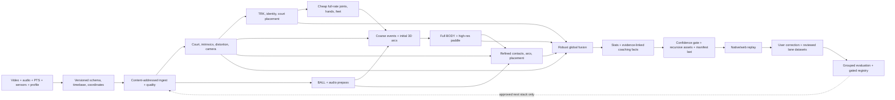

# DinkVision North Star

Last updated: 2026-07-09.
Status: `VERIFIED=0`.

## Authority and reading rule

This is the sole authority for:

- the product we are building;
- what is actually true today;
- the order of future work;
- promotion gates, stop rules, and the active agent queue.

If another narrative document conflicts with this file, this file wins. The
other active documents have narrower roles:

- `AGENTS.md`: durable repository rules and code navigation;
- `RUNBOOK.md`: commands, flags, actual stage order, artifacts, and failure diagnosis;
- `BALL_TRACKING_PIPELINE.md`: stable numbered BALL interface contract;
- `configs/racketsport/best_stack.json` and `models/MANIFEST.json`: selected defaults and checkpoint identity;
- `runs/`: dated evidence and history, never current truth merely because a file exists.

No root checklist, separate master plan, capability matrix, wave narrative, or
technical blueprint may become a second roadmap. Historical versions are
preserved under `runs/archive/root_docs_20260709/`.

## 1. The product

### 1.1 Promise

A player opens the iPhone app, records or imports one full pickleball game, and
receives the most accurate practical single-camera reconstruction we can make:

- synchronized original video and a metric 3D court;
- four persistent players with articulated 3D meshes;
- ball flight, bounces, contacts, landings, and in/out uncertainty;
- paddle pose at the moments where it can be supported;
- rally, shot, movement, positioning, and recovery facts;
- a short coaching plan whose claims jump back to the exact supporting moments.

The product must be fast enough to remain useful, but correctness and honesty
come before latency. Product inference is single-camera for v1. Extra cameras,
markers, and surveyed geometry are allowed for training and independent ground
truth, not as a hidden product requirement.

### 1.2 End-to-end user experience

| Step | User experience | Product requirement |
|---|---|---|
| 1. Onboard | Minimal account, consent, handedness, optional player/paddle/court profile | Profiles accelerate later sessions but the generic path must still work. Non-owner biometric persistence is opt-in only. |
| 2. Record/import | Record-first landscape camera or camera-roll import; full-court framing, stability, exposure, FPS, storage, and court-lock guidance | Recording never stalls because an advisory model is slow. Imports disclose reduced sensor confidence. |
| 3. Upload | Clear queued/uploading/processing/partial/failed/ready states | The app uploads the exact video plus one versioned sidecar and can prove which run belongs to it. |
| 4. Fast result | A trust-banded court map, rally segmentation, obvious contacts/bounces, and review clips when supported | Fast results are advisory and may abstain. They never masquerade as deep-world authority. |
| 5. Deep result | Synchronized video and 3D replay with court, net, four players, ball, paddles, contacts, and free-camera controls | Missing entities remain missing; predicted or preview geometry is visibly distinguished from measured evidence. |
| 6. Learn | A concise strengths card, the top three changes, one drill, and evidence-linked comparisons | Deterministic facts first. Language may phrase facts but cannot invent measurements or causality. |
| 7. Correct | User can correct ball/contact/shot outcomes and see “how measured” lineage | Corrections enter reviewed lane-specific datasets; they never silently overwrite raw observations. |
| 8. Improve | Session history and self-relative trends | Compare the player with themself under compatible setups before making population claims. |

### 1.3 Product surfaces and visual direction

The app is record-first and playful but clean. The current five-tab direction is
Replays, Stats, raised Record, Coach, and Profile. Record is the cold-launch
default. The raised ball-yellow record control becomes a red stop state with an
elapsed-time pill while recording.

The visual system uses the existing DinkVision ink-on-cream identity, court
green, ball yellow, trail blue/red, rounded cards, restrained hand-drawn
accents, and reduced-motion fallbacks. Accents belong on onboarding and empty
states, not on measured-data surfaces.

The deep-result screen must make these relationships obvious without crowding:

- original video and 3D/court-map views share one timeline;
- rally, contact, bounce, and shot markers are directly seekable;
- camera presets include court, follow-player, and free orbit;
- entity toggles cover player meshes/skeletons, ball trail, paddles, contact
  surfaces, target zones, and ghost positioning;
- every visible entity carries a compact trust badge;
- coaching cards include “jump to evidence” and “how measured”; and
- sample or fixture content is explicitly watermarked and never mixed with a
  real session.

The detailed brand implementation remains in `ios/README.md`; it does not own
product scope or sequencing.

### 1.4 Trust contract

Evidence provenance and product authority are separate axes. A directly
measured sample may still carry a preview badge when its pipeline has not
passed promotion.

| Evidence provenance | Meaning |
|---|---|
| `measured` | Direct observation or reviewed input, preserved with source identity. |
| `model_estimated` | Model-derived observation with confidence/covariance. |
| `physics_predicted` | Physics or temporal interpolation; never detection truth. |
| `missing` | No defensible evidence. |

| Authority badge | Meaning |
|---|---|
| `verified` | The named capability gate passed on independent preregistered data. |
| `preview` | Useful output from an unpromoted/scaffold path, including `estimated_preview`. |
| `low_confidence` | Evidence exists but is outside the trusted operating band. |
| `too_close_to_call` | Uncertainty crosses a decision boundary; the product abstains. |

`complete` means the minimum product bundle exists and every advertised URL
resolves. It does not mean the underlying CV is accurate. Accuracy is earned
only by the named independent-data gates below.

### 1.5 Product tiers

| Tier | Timing and surface | Authority |
|---|---|---|
| L0: live in-rally | On-device, sub-second capture guidance and sparse advisory overlays | Never promotes, trains, or issues officiating-grade calls. Recording is the priority. |
| L1: between-rally | On-device seconds after a rally/recording | Instant replay and broad advisory cues with abstention. |
| L2: server fast | Target roughly 1-2 minutes after upload, without deep BODY | Trust-banded court/ball/events/placement preview; no deep-world promotion. |
| L3: server deep world | Asynchronous full BODY, paddle, fusion, replay, stats, and coaching | The only product tier that may expose independently gated components as authoritative output or call the integrated result `VERIFIED`. Components may pass frozen NS-03 gates in isolation, but those remain scoped passes until L3 integration succeeds. |

Latency targets are measured end to end, including cold start, upload, compile,
transfer, asset build, and delivery. No named VM is a permanent runtime.

### 1.6 v1 Definition of Done

v1 is done only when three consecutive fresh, preregistered owner/friend games
complete the physical app-to-replay route and satisfy all of the following:

1. The video/sidecar/run identity is exact and reproducible.
2. Minimum replay assets load on native and web surfaces with every URL valid.
3. CAL, four-player TRK, BALL, BODY, contact, RKT, and world-fusion gates all
   pass. Optional presentation features may remain absent, but the core court,
   players, ball, paddle, contact, and fused-world product may not.
4. The replay preserves four player identities, metric court placement, ball
   and paddle relationships, and trust bands without visually convincing
   contradictions.
5. Coaching facts are deterministic, evidence-linked, and pass a zero-
   fabrication audit before language generation.
6. Privacy, deletion, authorization, security, and commercial-license gates
   pass for non-owner use.
7. L3 is delivered in ≤2× source-video duration end to end across all three
   games, including upload, cold start, compile, transfer, asset build, and
   delivery. Accuracy/full-mesh gates are not weakened to reach the SLA.

## 2. Current truth

### 2.1 Product-level blockers

These are more important than another isolated model campaign:

| ID | Current defect | Consequence | Exit gate |
|---|---|---|---|
| P0-A | Swift and Python v1 sidecars disagree | A real capture can fail before CV begins. | Swift-encoded golden fixtures and one physical sidecar validate on the server. |
| P0-B | Presigned video+sidecar upload and clip-status refresh are code-wired, but ready job → manifest → matching replay is unwired and multipart attempt state is not restart-safe | A relaunch can duplicate/orphan an upload, and “Open” still selects the local row rather than the uploaded run. | Mid-part and sidecar-failure relaunch tests preserve/abort one server attempt; one physical record/import → upload → GPU → own replay trace. |
| P0-C | Source identity and reuse are not content-addressed; `--force` is incomplete | New metadata/models can reuse old pixels or results. | Source/code/model/config/upstream hashes invalidate exactly the dependent closure. |
| P0-D | Raw, undistorted, reference, and world coordinates are inconsistent | Lens-edge geometry creates systematic player/ball/paddle errors. | One declared transform API passes distorted synthetic and real iPhone tests. |
| P0-E | `partial` can become server `complete`/“Replay ready” | Missing capabilities are hidden from users. | Status, missing capabilities, and trust bands survive worker/API/app unchanged. |
| P0-F | Directory assets and post-manifest facts can be omitted | Meshes/stats/coaching may exist but never reach the app. | Recursive atomic packaging; stats/coaching before manifest; every URL checked. |
| P0-G | Extracted audio is ignored on the normal event path; events run before fresh BODY/paddle, can reuse stale contacts, omit ball-size depth, and collapse planar paddle ambiguity | Available evidence cannot improve contacts/flight and an early guess can look measured. | Dependency-safe coarse → deep → refined events/arcs; audio/diameter affect independent error; both IPPE poses and corrected confidence survive to fusion. |
| P0-H | Capture evidence can silently truncate or diverge from the encoded movie; native intrinsics, dropped-frame reasons, ARKit pose time, crop/orientation, and sensor clocks are not one contract | Long/high-FPS sessions can carry plausible but mis-timed or mis-scaled evidence into every lane. | Physical 30-second and 5-minute captures have no silent truncation, monotonic encoded PTS, and an aligned sample or explicit missing/drop reason per frame. |

### 2.2 Capability snapshot

Numbers from different protocols are not compared directly.

| Area | Built today | Best honest evidence | Binding next gate |
|---|---|---|---|
| DATA | Owner/public ingest, prelabel, CVAT review, dedup, PTS and protected-eval guards | 1,750 reviewed BALL rows prepared; only the 1,121 clip-folded/disagreement-selected card was scored | Uniform-random audit + true source groups + fresh untouched owner/HARVEST holdout with audio |
| CAL | Manual/metric/profile paths, distortion and ChArUco tools, preview auto-find | Corrected owner PCK@5 is 0 for learned candidates; synthetic-only transfer failed twice | Profile + guided confirmation for v1; auto-find needs owner-viewpoint PCK@5 ≥0.95 and handheld/distortion gates |
| TRK | YOLO26m, BoT-SORT/ReID, raw-pool association, court placement | Mean IDF1 about 0.852; worst about 0.756 with six switches and worst four-player coverage about 0.885 | Every fresh clip: IDF1 ≥0.85, zero switches, zero spectator FP, zero far-off-court FP, coverage ≥0.95 |
| BALL | WASB default, candidate training, bounce/in-out, audio/events, arc/sanity chain | Standing anchor F1@20 0.7248, recall@20 0.626, hFP 0.063; candidate A is 0.6152/0.654/0.2506 on a different internal card | Same-protocol F1@20 ≥0.90, recall@20 ≥0.75, hFP ≤0.05 plus contact/in-out/tail gates on fresh data |
| BODY | SAM-3D-Body runtime, mesh index, placement, grounding and foot-lock | External root-relative 59.7mm, PA 39.9mm, grounding-consistent 76.5mm; about 23-27mm decode residual remains unexplained | Corrected decode gate; independent court-frame world-MPJPE ≤50mm; `grounding_metrics.max_foot_lock_slide_m` ≤0.03; no candidate-label promotion |
| RKT | Default-wired wrist/palm/grip `estimated_preview` | Rectangle IoU about 0.224-0.331; no true pose/contact GT | Marker/corner GT; checked-in promotion gates: face-angle p90 ≤5° and contact-point p90 ≤3cm. The old 30° bar is an interim candidate milestone only. |
| EVENTS/PHYS | Ball/audio/wrist fusion, fill, confidence bands and foot postprocessing | Useful internal slide reductions; no reviewed product event gate | Contact timing p90 ≤40ms, bounce-vs-hit/in-out gates, corrected acoustic/A/V timing, no standalone regression |
| REPLAY/STATS | Web/native boundaries, ghost previews, movement stats | Scoped viewer load; prior proof had low FPS and missing ball/contact/paddle/trust content | Current full bundle, full computed-frame mesh policy, native/web visual/perf/every-URL proof |
| COACHING | Movement metrics and shot/fact scaffolds | Placement/court stats only; no verified user-facing coach | Deterministic facts before manifest, reference/faithfulness checks, zero fabricated numbers |
| E2E | A 19-outcome CLI plus code-wired video/sidecar upload and clip-status refresh | Swift package tests are scoped code proof; ready-manifest routing, restart safety, and a current physical-app bundle remain unproved | Complete NS-01 through NS-05, then one clean current-stack reproduction |

The active BODY stack is SAM-3D-Body only. RTMW, RTMW3D, RTMPose, and MMPose
are retired from the pickleball pipeline. The separately tested
Fast-SAM-3D-Body challenger regressed end-to-end speed/fast-swing accuracy and
remains rejected unless a new bounded hypothesis directly addresses that miss.

`VERIFIED=0` remains binding. Test green, schema green, a browser load, a
partial run, or an attractive overlay is not a capability promotion.

Capability/evidence status is separate from per-object trust:

| Status | Meaning |
|---|---|
| `VERIFIED` | Named independent-data promotion gate passed. |
| `scoped pass` | A named slice passed inside its declared scope only. |
| `smoke-verified` | Execution/presence proof, not accuracy. |
| `partial` | Some declared outputs are missing or degraded. |
| `review-only` | Intended for human inspection, never authority. |
| `rejected` | Measured candidate failed or regressed; preserve the result. |
| `no-attempt` | Candidate was not run because prerequisites/access were absent; not negative model evidence. |

### 2.3 What not to repeat without new evidence

- naive detector voting for BALL;
- another synthetic-only CAL retrain without real viewpoint supervision;
- more association-only TRK sweeps without detector/domain/ReID leverage;
- self-generated 3D used as validation truth;
- rectangle or box IoU promoted as paddle 6DoF;
- Fast-SAM-3D-Body replacing the current BODY path after the measured regression;
- scalar Magnus/spin claims before trusted contacts and flight GT;
- generic neural rendering used as measurement authority;
- threshold shopping on Outdoor or relabeling it as a fresh holdout.

Indoor remains protected. Outdoor remains protected from further leakage but is
a historical benchmark, not statistically fresh promotion evidence.

## 3. Target CV architecture and data reuse

The pipeline is a provenance-aware two-pass DAG. Separate lanes are valuable,
but their data must meet again before a world or coaching claim is produced.

### 3.1 Reuse contract

| Producer | Required consumers | Never allowed |
|---|---|---|
| Capture/timebase | encoded PTS, native intrinsics/crop, drop reasons, every frame-aligned stage, audio correction, rolling-shutter model | Assume CFR, silently truncate sensors, or align “latest” ARKit/tap samples to the movie. |
| Court/camera | membership, placement, ball 3D/in-out, BODY grounding, paddle, net, fusion, metrics | Publish a homography without coordinate space, distortion state, and covariance. |
| TRK/person authority | stable ID plus bbox, true mask, cheap joints, court footpoint, visibility, embeddings and confidence feed BODY, camera exclusion, paddle, hitter, events and replay | Import lexical “latest,” equate role/side with identity, or use BODY translation as identity truth. |
| BALL/audio prepass | top-K points, visibility, blur/diameter, rally spans, contact proposals, mesh schedule, initial arcs | Become contact authority by itself or drop raw/corrected timing. |
| Cheap joints/hands | event refinement, mesh schedule, paddle initialization, foot phases | Arrive only after events are frozen. |
| BODY | paddle grip, stance/sole, biomechanics, placement refinement, fusion | Relabel placement-derived coordinates as BODY-derived because a skeleton file exists. |
| Paddle | all plausible planar poses, contact refinement, outgoing-ball constraints, swing facts, fusion | Claim 6DoF from rectangle IoU or discard the second IPPE pose by reprojection alone. |
| Refined events/arcs | shot taxonomy, slow motion, landing/in-out, fusion | Validate only by a smaller optimizer residual. |
| Global fusion | one refined world with covariance/provenance | Overwrite immutable observations or train/evaluate on unreviewed fused output. |
| Product gate | replay visibility, wording strength, review queue | Turn “artifact exists” into “accurate.” |

### 3.2 Minimum inspectable deep-result bundle

A deep job is inspectable and status-reportable only when it owns and validates:

- source identity and versioned capture sidecar;
- court/camera calibration plus coordinate/time metadata;
- persistent player tracks and declared BODY coverage;
- ball, event, arc, paddle, and fusion artifacts or explicit missing reasons;
- deterministic stats/coaching facts built before the manifest;
- recursive replay assets, trust bands, and a manifest whose every URL resolves;
- a summary that reports `complete`, `partial`, or `failed` without translation.

`complete` additionally requires every mandatory v1 artifact and gate named in
Section 1.6. An explicit missing reason makes a bundle inspectable, not complete;
the job must remain `partial`.

### 3.3 Coaching safety boundary

Before upstream gates pass, user-facing authority is limited to current
placement/court movement facts with their preview lineage. Contact height and
stance require BODY+contact gates; apex/net clearance/landing require BALL+
CAL+event gates; paddle facts require RKT. Even after those gates, do not ship
torque, muscle load, injury risk, exact high-speed angular velocity, or causal
shot-error attribution without separate athletic validation.

## 4. Ordered execution program

Phases execute in order. Work explicitly marked parallel may overlap only after
its dependencies exist. Every task must save a report under `runs/`, identify
source/code/model/config versions, score the frozen gate, and state
`adopt`, `reject`, `partial`, or `no-attempt`.

### NS-01 — Make the real product route correct

Nothing else can produce trustworthy user evidence until NS-01 is complete.

| Task | Outcome and owned surfaces | Acceptance gate | Stop/kill rule and unlock |
|---|---|---|---|
| NS-01.1 Capture/sidecar truth | One versioned schema across Swift/import/Python/server; stream sensor samples; enumerate encoded PTS; store native intrinsics with reference crop/orientation, drops, clocks and rolling shutter | Golden fixtures plus physical 30-second/5-minute and supported high-FPS captures: no silent truncation, monotonic PTS, every frame aligned or explicitly missing | Do not loosen Python or derive authority from an optional late-discard tap. Unlocks sensor/CAL truth. |
| NS-01.2a Complete production upload lifecycle | Finish the code-wired video+sidecar path: persisted multipart identity/ETags, restart/abort semantics, honest job polling, ready manifest, and matching replay routing | Focused Swift/server tests cover death after a part and after video-before-sidecar; one capture ID survives clip/job/manifest/replay | A new clip on relaunch or local-row replay fails. Mocked tests are not physical proof. |
| NS-01.2b Prove physical upload | After NS-01.3-01.5 settle identity/status/assets, run final device record and camera-roll traces | Saved 30-second traces prove record/import → upload → job → artifact → own replay with auth | Any manual artifact substitution fails the gate. Unlocks real E2E evidence. |
| NS-01.3 Content-addressed run DAG | Source SHA-256/size/timing identity; code/model/config/upstream fingerprints; explicit inputs win; atomic transactional stage dirs | Same clip ID with different video cannot reuse pixels; changed dependency rebuilds exact closure; identical dependency reuses safely | Do not expand `--force` into another manual deletion list. Unlocks reproducible evaluation. |
| NS-01.4 Coordinate/time convention | Typed encoded/raw→undistorted→reference→court/world transforms; PTS/VFR, native-intrinsics scaling, A/V mux, acoustic propagation, sensor clocks and rolling shutter | Distorted synthetic and real iPhone tests; corrected event/geometry error beats raw path on independent labels | Do not mix coordinate spaces, align latest samples, or correct audio destructively; preserve raw values. Unlocks trustworthy fusion. |
| NS-01.5 Honest status and packaging | Minimum bundle policy; partial propagation through runner/worker/API/app; recursive atomic copy; stats/coaching before manifest | Missing BODY/ball/paddle/assets remains `partial`; complete requires every advertised URL; local and SSH paths agree | Exit 0 is not sufficient. Unlocks meaningful product-ready state. |
| NS-01.6 Current spine cleanup | Remove duplicate legacy stage graph, type expected optional failures, fail on programming/schema errors, validate complete frame schedules | One authoritative stage graph and tests for cold, reused, partial, and failure paths | Do not hide arbitrary exceptions as degraded stages. Unlocks two-pass integration. |
| NS-01.7 Evidence plumbing | Make classified audio affect events; hash contact dependencies; pass blur/diameter; retain both IPPE poses; mark repaired confidence; run one post-BODY/RKT refinement | Focused tests plus independent contact/3D/RKT ablations prove each new consumer; unsupported evidence remains missing | Do not raw-average modalities or promote on residual/overlay gains. Unlocks NS-04 fusion. |

**NS-01 exit:** one physical capture opens its own correctly identified replay,
with honest missing capabilities and no stale artifact path.

### NS-02 — Build independent truth and reset evaluation

| Task | Outcome and owned surfaces | Acceptance gate | Stop/kill rule and unlock |
|---|---|---|---|
| NS-02.1 Gold capture protocol | Product phone plus two auxiliary high-FPS phones, surveyed court/net, ChArUco, LED/audio sync, paddle markers, scripted shots/occlusions | Static points within 2-3cm, inter-camera sync ≤0.5 frame, uncertainty saved for dynamic labels | Extra cameras are GT only. Unlocks CAL/BODY/BALL-3D/RKT/contact truth. |
| NS-02.2 Lane-specific GT | Versioned CAL points, person IDs/boxes, 3D joints/sole contacts, ball centers/events, paddle face/markers | Each label has source, frame/PTS, reviewer, uncertainty, and immutable raw reference | Candidate predictions cannot become independent GT. |
| NS-02.3 Representative audit | Add uniform-random reviewed frames alongside disagreement-selected examples | Report performance separately on random, hard/occluded, seen, and unseen strata | Do not average away the unseen-source gap. |
| NS-02.4 True source grouping | Group by source game/session/court/device before any candidate selection | No frames/clips from one source cross train/selection/test; 1,750 BALL folds scored source-disjoint | Leave-one-clip is not source-LoSO. |
| NS-02.5 Fresh promotion ledger | Pre-register metrics, thresholds, candidate, code/checkpoint/training-data provenance, transitive licenses, and untouched owner/HARVEST sources | Ledger/license card exists before inference; one-shot result retained whether pass or fail | No threshold shopping or noncommercial candidate in the selected product stack. Unlocks component promotion. |

**NS-02 exit:** every component has an independent, source-disjoint route to a
frozen gate. This phase should run immediately after NS-01 design stabilizes;
capture preparation can overlap NS-01 implementation.

### NS-03 — Improve components in parallel against the same truth policy

The model-improvement lanes may run in parallel after NS-02 supplies their
required labels. LIVE infrastructure, capture guidance, and thermal-soak work
are explicitly exempt and may begin after NS-01.1/01.2a; deploying a BALL
student still waits for the NS-03.BALL gate.

| Lane | Exact next sequence | Promotion gate | Kill/defer rule | Downstream unlock |
|---|---|---|---|---|
| NS-03.CAL | Ship device/lens profiles + guided confirmation; validate native intrinsics/distortion/rolling shutter; test AnyCalib only as an import prior; try DPVO/MegaSaM only after labeled moving-import failure | Owner-viewpoint PCK@5 ≥0.95, net-height error ≤2cm, reprojection/distortion/handheld gates | No third synthetic-only retrain; AnyCalib/SfM never court authority; native static path stays profile/ARKit/known-court first | Metric world, in/out, grounding, placement, fusion |
| NS-03.TRK | Freeze scorer/provenance → fix detector/domain/off-court errors; benchmark RF-DETR det/seg → ReID → McByte mask cue on worst clips → only if needed CAMELTrack/constrained tracklets | All fresh clips IDF1 ≥0.85, 0 switches, 0 spectator FP, 0 far-off-court FP, coverage ≥0.95 | Stop association-only sweeps; each later step keeps detections fixed; reject >20% detector or >10% association wall increase without full-gate gain | Shared person authority for BODY/camera/paddle/hitter/stats |
| NS-03.BALL | Freeze source groups/strata → score WASB, Candidate A, existing TOTNet adapter and RacketVision checkpoint on all 1,750 rows → train high-res/court-crop visibility+blur challenger → after 3D GT add diameter and simple-physics/lift-first ablations | F1@20 ≥0.90, recall@20 ≥0.75, hFP ≤0.05 plus p95/p99, teleport, contact, bounce, 3D landing and in/out gates | No duplicate TrackNet integration, raw voting, tuned holdout, or spin claim; reject subset gains that worsen global hFP/tails/runtime | Events, arcs, mesh schedule, shots, replay |
| NS-03.BODY | Fix the 23-27mm decode residual → collect fast-athletic GT → score current path → severe-occlusion masklet-only SAM-Body4D with completion disabled → bounded GEM-X temporal whole-body/hands challenger | Court-frame world-MPJPE ≤50mm, `grounding_metrics.max_foot_lock_slide_m` ≤0.03, ≥15% p90 wrist/foot/jitter gain for replacement, mesh/joint/identity consistency | Keep SAM-3D-Body default on no-attempt/regression; full SAM-Body4D completion is killed for latency; synthetic/internal metrics do not promote GEM-X | Paddle, biomechanics, placement refine, fusion |
| NS-03.RKT | Capture 4-corner/normal/contact GT → released RacketVision 5-keypoint zero-shot → pickleball high-res fine-tune → retain both IPPE poses → resolve with hand/time/ball/surface; only then trajectory cross-attention or GigaPose | Interim candidate milestone: face-angle p90 ≤30°. Promotion: face-angle p90 ≤5°, contact-point p90 ≤3cm, no BALL/BODY regression | Rectangle IoU, one-solution reprojection and box orientation remain preview; candidate must beat current preview and local supervised baseline | Refined contacts, swing facts, ball impulse, fusion |
| NS-03.EVENTS | Fix audio/time plumbing → label hit/bounce/net/stomp/other → coarse proposals → deep BALL/BODY/RKT → refined global assignment and arc/schedule once; AdaSpot only after labels | Source-disjoint contact timing p90 ≤40ms plus bounce-vs-hit/hitter/coverage and no standalone regression | A loose published collar, raw confidence average, or improved proposal recall alone does not promote | Correct deep windows, contacts, arcs, slow motion, shots |
| NS-03.LIVE | After NS-01.1/01.2a: ship capture guidance/live court lock, person model and record+infer thermal soak; test ARKit-owned 60fps capture, retain AVFoundation high-speed; BALL student waits for BALL gate | Record never drops/stalls; sustained cadence/thermal/pressure/drop budget; ≥99% aligned ARKit pose if selected; every call advisory/abstaining | Live work may parallel server lanes but never weakens recording/server gates; unsupported modes and unpromoted models stay kill-switched | Trustworthy L0/L1 capture and between-rally product |

Every lane must score its baseline first, use the same scorer for each candidate,
record runtime without making it the accuracy gate, and update the selected
stack only after a named pass. Before execution, pin code, checkpoint,
training-data provenance and transitive licenses; research-only candidates may
produce diagnostics but cannot enter the selected product stack.

### NS-04 — Join the lanes into one world

| Task | Outcome | Acceptance gate | Stop/kill rule |
|---|---|---|---|
| NS-04.1 Coarse pass | BALL/audio + cheap joints propose rallies, contacts, bounces, hitters, initial arcs, and BODY compute windows | High-recall proposals with uncertainty; no authority claim | Do not freeze or promote coarse contacts. |
| NS-04.2 Deep pass | Run full BODY and high-resolution paddle on the planned cadence, including every computed frame required by the full-mesh policy | Coverage/provenance complete; no byte budget silently removes required frames | Fail partial if required deep inputs are absent. |
| NS-04.3 Refined pass | Recompute contacts, bounce/hit class, hitter, arcs, landing, and placement from same-run wrists/paddle/BODY/audio | Contact p90 ≤40ms and arc/landing error improve on independent GT without standalone regression | Never reuse no-wrist contacts as current after BODY changes. |
| NS-04.4 Surface priors | Ball center one radius from paddle/court surfaces; projected paddle contact inside face polygon; bounded impulse/friction; sole/mesh on court | Independent contact/bounce/floor errors improve | Never snap ball center to a plane or ankle centers to the floor. |
| NS-04.5 Robust global fusion | Progressively optimize camera/time, player root/pose, ball segments, multiple paddle/identity hypotheses and contacts with robust/switchable factors | Independent world-MPJPE, paddle-surface contact, bounce/landing, sole/floor, event and reprojection improve; multiple-initialization and leave-one-modality/fixed-anchor ablations pass | Raw observations immutable; one early hypothesis, residual reduction and visual plausibility never promote. |
| NS-04.6 World output | One refined world candidate with covariance, provenance, trust bands, and raw/refined separation | Viewer and artifact checks pass; unsupported elements absent/banded | Unreviewed fused output cannot train or validate its own inputs. |

### NS-05 — Turn the world into a useful product

| Task | Outcome | Acceptance gate | Stop/kill rule |
|---|---|---|---|
| NS-05.1 Deterministic facts | Generate rally, shot, movement, positioning, recovery, landing and contact facts before the manifest | Reviewed correctness and complete lineage; shot macro-F1 ≥0.65 and top-2 accuracy ≥0.85 | No claim whose source cannot be opened. |
| NS-05.2 Coaching comparator | Convert facts into reference/self-relative comparisons and rank the top three actionable changes | Expert rubric and user audit; facts unchanged by wording layer | Do not feed free-form raw numbers to the language model. |
| NS-05.3 Language layer | Phrase approved facts, one drill, and evidence links | Usefulness ≥8/10 and fabrication 0/300; every claim opens its evidence; owner + ≥4.0 player review | Language cannot invent injury/torque/load claims. |
| NS-05.4 Replay assets | Metric MHR meshes first, banded contact/ball/paddle overlays and free-camera comparisons; optional MoVieS-style appearance only after metric gates | Native/web visual QA, target FPS/size measured, every URL valid; appearance checked for temporal identity/hallucination | No fixture as user data; render-only appearance and unseen surfaces are predicted, never measurement/stat authority. |
| NS-05.5 Correction flywheel | User edits route to lane-specific reviewed queues with provenance | Round-trip correction tests and dataset version increments | Product corrections never mutate protected test labels or raw artifacts. |

### NS-06 — Optimize speed, cost, and reliability with metric parity

Start only after NS-01 correctness and stable NS-04/05 outputs make timing
meaningful. Current runtime evidence says cold start, compile, decode/I/O, and
transfer dominate more than steady inference in some BODY buckets.

| Task | Sequence | Gate |
|---|---|---|
| NS-06.1 Profile | Measure cold/warm stage time, GPU utilization, compile buckets, decode, upload/download, asset build, size, and cost | One reproducible trace on the current stack; no reused/stale timing artifacts. |
| NS-06.2 Remove waste | Shared decode/PTS, GPU-resident frames where appropriate, persistent workers, persisted stable compile buckets, batched players/windows, stage overlap; then ONNX/TensorRT/DALI/quantization only when the trace justifies each | Each lever improves full p95 wall time and preserves all frozen metrics/timestamps; revert independently on drift. |
| NS-06.3 Tier delivery | Make L2 fast result useful while L3 continues; stream honest progress/capabilities | No duplicate inference that outweighs latency; partial semantics preserved. |
| NS-06.4 Reliability/cost | Preemption-safe jobs, resume, idempotency, observability, teardown, fully loaded $/game-hour | Three fresh runs without orphaned resources or status drift; measured cost reported as a range until invoice-backed. |

Target progression is first a reliable useful wait, then ≤2× video duration,
then ≤1× only if measured levers support it. Accuracy and full-mesh requirements
are not weakened to hit a headline.

### NS-07 — Launch safely and prove repeatability

| Task | Outcome and gate |
|---|---|
| NS-07.1 Security/auth | Close the three HIGH findings, enforce user/job/artifact authorization, secrets/dependency scans, abuse limits, and audit logs. |
| NS-07.2 Privacy/deletion | Explicit biometric/video consent, retention policy, export, delete cascade, and session-only default for non-owner data until opted in. |
| NS-07.3 Commercial path | Model/code/data/license inventory and commercial-clean selected stack. Private development may continue; monetized launch may not bypass this gate. |
| NS-07.4 Friend onboarding | A non-owner completes setup, capture/import, upload, replay, correction, and delete without developer intervention. |
| NS-07.5 Repeatability | Three consecutive fresh preregistered games pass the v1 Definition of Done. Any failed game resets the consecutive count after the defect is fixed. |

## 5. Active queue for the next agents

Do not start another broad model search. The next executable goals are:

| Order | Agent goal | Scope boundary | Required handoff |
|---:|---|---|---|
| 1 | **NS-01.1 Capture/sidecar truth** | Swift/Python schema, encoded PTS/native intrinsics/drop/sensor persistence; no model work | Fixtures, focused tests, 30-second/5-minute/high-FPS physical protocol |
| 2 | **NS-01.2a Upload lifecycle** | Finish the code-wired app/server path: mid-part restart, job/manifest, matching replay; no final E2E claim | Focused relaunch/call-path tests and one traceable capture/clip/job/manifest identity |
| 3 | **NS-01.3 Content-addressed DAG** | Ingest/reuse/force/transaction tests; preserve current stage behavior otherwise | Dependency model, collision tests, migration behavior, focused process-video suite |
| 4 | **NS-01.4/01.5 Coordinates, status, packaging** | One encoded/time/transform API and honest server/app delivery; no model tuning | Distortion/clock/drop tests, minimum bundle, partial propagation, every-URL proof |
| 5 | **NS-01.6/01.7 Spine and evidence plumbing** | One `process_video.py` owner; audio, post-BODY events, dependency hashes, ball size, both paddle hypotheses | Cold/reuse/partial/failure tests plus modality ablations; no promotion claim |
| 6 | **NS-01.2b Physical upload proof** | After identity/status/packaging/restart settle; production app and real device | Saved record/import → upload → job → manifest → matching replay trace |
| 7 | **NS-02 gold-capture package** | Protocol, calibration/sync tools, lane labels and candidate license-card template; product remains monocular | Dry-run package and explicit owner half-day checklist |
| Parallel now | **NS-02.3-02.5 evaluation reset** | Source grouping, random audit, ledger, and 1,750 baseline card do not wait for the new capture | Dataset cards, group audit, preregistered baseline commands |

After NS-02 gates exist, dispatch CAL/TRK/BALL/BODY/RKT as file-fenced parallel
NS-03 lanes in the exact row order above. First challengers are the existing
TOTNet adapter/RacketVision, high-resolution BALL, RF-DETR then McByte,
masklet-only SAM-Body4D then GEM-X, and AnyCalib as an import prior. The bounded
LIVE lane may already run, but BALL deployment waits for its gate. NS-04 remains
one serialized owner of `process_video.py`; NS-05 follows an improved world.

Current background Wave-7 GPU work may finish and save its reports, but it does
not supersede this queue. A running process, incomplete report, or speed number
does not change the order above.

**Dated evidence note (2026-07-09, owner live-critique session — feeds NS-01.4/01.6 scope, order unchanged):**
the world BALL overlay FAILS OPEN during arc-solver fallback — 9/11 wolverine segments were
`fit_bvp_fallback` yet all 263 fallback frames rendered solid world positions (z to 23.5 m, 10
underground, 32 transitions >20 m/s) and 210 were labeled "measured" downstream; 2D track itself was
~81% visible and owner-judged good. Trust-doctrine violation; single highest-leverage ball-visual fix
= fail-closed world overlay + arc demotion/provenance propagation. Also from the same session: viewer
video sync seek-snaps (lag-then-jump), mesh render fps ceiling (renderer-bound, 244/244 frames were
computed), replay manifests carry non-portable absolute paths, and the CLI cold-upload court-trust
chain dead-ends after corner taps (no human-verified tap tier; correction task loop unfinished).
Evidence: runs/lanes/w7_ball3ddiag_20260709/DIAGNOSIS.md · runs/lanes/w7_critique_20260709/.

### Owner-only asks

| Rank | Ask | Why | Safe default while waiting |
|---:|---|---|---|
| 1 | Provide a short signed-device/Xcode session for one real sidecar and upload trace after NS-01.1/01.2a land | Immediate product-contract and upload gate | Simulator/golden fixtures proceed; physical proof remains blocked. |
| 2 | Schedule one half-day cross-lane gold capture with product phone, two high-FPS phones, surveyed court/net, ChArUco, audio/LED sync, and paddle markers | Independent truth for CAL/BODY/BALL-3D/RKT/contact | All affected lanes remain unverified; engineering prepares tooling. |
| 3 | Continue BALL labeling with a uniform-random audit stratum | Representative source-group evaluation and the 3k checkpoint | Train/score only current reviewed data; no promotion. |
| 4 | Approve biometric/video retention and deletion behavior before non-owner persistence | Friend launch and profile reuse | Session-only non-owner processing; persist no biometric profile. |
| 5 | Commit owner + one ≥4.0-rated player to the later coaching audit | Usefulness ≥8/10 and fabrication 0/300 gate | Build deterministic facts/rubric only. |
| 6 | Supply invoice-backed cloud cost during NS-06 | Honest product economics | Report conservative ranges, not precise cost. |

## 6. Standing rules

1. Stay on `main` unless the user explicitly asks otherwise; preserve unrelated dirty work.
2. Read this file, `AGENTS.md`, and the relevant `RUNBOOK.md` section before changing direction.
3. `VERIFIED`, `smoke-verified`, `scoped pass`, `partial`, `review-only`, `rejected`, and `no-attempt` are distinct.
4. Baseline first; score every candidate with the same scorer and frozen dataset/gate.
5. Protected data never becomes training data. Outdoor is historical, not fresh.
6. Raw observations are immutable. Refinements are separate artifacts with provenance/covariance.
7. Explicit user inputs must win over cache. No lexical “latest” imports.
8. Every stage declares coordinate space, timebase, source/model/config identity, and trust band.
9. One integration owner serializes `process_video.py` changes; separate lanes own CAL/TRK/BALL/BODY/RKT files.
10. Expected missing optional evidence may degrade; schema/programming errors fail loudly.
11. Best-stack changes require a named gate pass plus pinned code/checkpoint/training-data provenance and transitive commercial-license review.
12. Visual overlays, smaller residuals, internal validation, copied fixtures, and test green are not accuracy proof.
13. Every completed task writes a dated `runs/` report; root docs do not accumulate wave logs.
14. Volatile coordination lives in `runs/manager/inflight_lanes.md` and `runs/manager/gpu_fleet.md`, not a root checklist.
15. Update this file only when product truth, sequencing, gates, or the active queue materially changes.

## 7. Evidence and history

- Deep code/results/research review and detailed flowcharts:
  `runs/CV_PIPELINE_DEEP_REVIEW_20260709.md`.
- Multi-agent SOTA review, ranked experiment register, licenses, and kill rules:
  `runs/CV_SOTA_RESEARCH_20260709.md`.
- Exact pre-consolidation plans, checklists, capability tables, blueprints,
  owner check-ins, and goal documents:
  `runs/archive/root_docs_20260709/INDEX.md`.
- Current selected defaults: `configs/racketsport/best_stack.json`.
- Checkpoint identity: `models/MANIFEST.json`.
- Held-out preregistration: `runs/manager/heldout_eval_ledger.md`.
- Current transient work: `runs/manager/inflight_lanes.md` and
  `runs/manager/gpu_fleet.md`.
- Historical research: `runs/research_sota_20260705/` and
  `runs/research_w6refresh_20260709/`.

Historical files are evidence, not instructions. A future agent should be able
to determine the product goal, current blocker, next task, gate, and stop rule
from this North Star without reading the archive.
