# Pickleball CV Pipeline Deep Review

Review date: 2026-07-09  
Code snapshot: `89400a0a0` on `main`  
Truth status: `VERIFIED=0`

This is a reviewer artifact, not a promotion record. It reconciles the live
pipeline, iOS/server contracts, current best-stack manifest, representative
training and evaluation artifacts, failure history, current research, and the
product goal:

> A player records or uploads one pickleball game, receives the most accurate
> practical 3D reconstruction of the game, and gets fast, evidence-linked
> feedback that helps them improve.

The active H100 speed gate was still running when this review was written. It is
not treated as a result.

## Later same-day correction

The shared checkout changed after this snapshot. The iOS app now constructs a
production presigned-upload coordinator, sends the video plus exact sidecar,
and refreshes clip status. Item 2 below is therefore historical. The remaining
truth is narrower but still blocking: ready job → manifest → that capture's
server replay is unwired, multipart upload identity/ETags are not restart-safe,
and no physical/backend trace has passed. The current authority and exact queue
are in `NORTH_STAR_ROADMAP.md`; the new research register is
`runs/CV_SOTA_RESEARCH_20260709.md`.

## Executive verdict

The project is not green-field. It has a large, unusually well-instrumented CV
scaffold: capture metadata, calibration paths, person and ball tracking,
SAM-3D-Body, paddle estimation, world composition, confidence bands, replay,
evaluation tools, reviewed labels, and thousands of tests.

It is also not yet an end-to-end product. Six issues dominate every new model
experiment:

1. The Swift capture-sidecar payload is incompatible with the Python schema.
2. The production iOS app does not yet call the upload/job/replay clients.
3. Run reuse is not content-addressed and can mix a new upload with an old
   source and old downstream artifacts, including under `--force`.
4. Raw versus undistorted pixel coordinates are not normalized consistently.
5. A partial/degraded pipeline can be surfaced by the server as complete and
   “Replay ready.”
6. The current single pass runs ball arcs and events before BODY/paddle, so
   same-run wrists, hands, paddle pose, and refined placement cannot improve
   same-run contacts or ball flight.

The strategic consequence is simple: fix truth, identity, timing, and dataflow
before spending another wave tuning isolated models. After that, the best
accuracy lever is independent cross-lane ground truth plus the existing
in-domain data flywheel. Global fusion is still the correct capstone, but its
current “snap toward coincidence” design must be replaced by physically correct
surface constraints and anti-circularity gates.

## What was reviewed and freshly checked

- Canonical docs, `configs/racketsport/best_stack.json`, and
  `models/MANIFEST.json`.
- The live 6,164-line production entrypoint:
  `scripts/racketsport/process_video.py`.
- Swift capture/import/upload/replay modules and Python server/worker paths.
- Representative CAL, TRK, BALL, BODY, RKT, replay, security, licensing, and
  E2E run artifacts, including Wave 7.
- Current local processes, the background manager, and the active GPU lane.
- Focused local verification after the documentation reconciliation: 180 tests
  passed in 42.63 seconds. The latest
  banked full Wave-7 census is 3,315 passed, 0 failed, 26 skipped. Neither test
  result is a CV accuracy promotion.

## P0 reviewer findings

| ID | Finding | Direct evidence | Why it matters | Required direction and exit gate |
|---|---|---|---|---|
| P0-A | Swift and Python sidecar schemas disagree | Swift always encodes `provenance`, `arkit_frame_samples`, and `unavailable_sensor_reasons` and may encode setup/policy/profile fields; Python uses `extra="forbid"` and omits them. Swift also allows `locked`, `intrinsics`, and `gravity` to be absent while Python requires them. See `ios/Core/Sources/PickleballCore/CaptureSidecar.swift:67-95,157-185,220-249` and `threed/racketsport/schemas/__init__.py:65-68,112-142`. A fresh live-style validation reproduced `extra_forbidden` for the three always-encoded fields. | A real app capture can fail at the calibration boundary before CV begins. Camera-roll imports can fail for additional missing required fields. | One versioned canonical schema; typed unavailable-sensor reasons; Swift-encoded golden fixtures validated by Python; one real device sidecar accepted by the server. |
| P0-B | Record-to-upload-to-replay is not a production vertical slice | Upload clients exist, but repo search found no production construction/call of `RenderGatewayUploadRequest`, `submitJob`, `PresignedUploadClient`, or the calibration packager; auth is dark. | Simulator/unit tests and an installed app do not prove the user journey. | One physical 30-second capture: record/import -> package sidecar -> upload -> poll -> run -> open replay, with saved device/server evidence. |
| P0-C | Source identity can be silently corrupted | `_stage_ingest` leaves an existing `clip_dir/source.<suffix>` untouched, probes the newly requested video, then derives PTS and all pixels from the old target. `--force` does not remove or replace `source.*`. See `process_video.py:423-469,753-778`. | A plausible replay can belong to the wrong user video while metadata names the new upload. | Persist source SHA-256, size and timing identity; atomically replace on force; reject or invalidate the whole DAG on mismatch; add same-clip/same-suffix collision tests. |
| P0-D | Cache invalidation and explicit-input precedence are unsafe | Reuse is mostly file existence plus schema shape. Existing calibration/tracks/ball can win before explicit replacement inputs; frames reuse if any JPEG exists; arc/BODY/paddle outputs can be reused without dependency fingerprints. See `process_video.py:784-801,1062-1075,1792-1801,1888-1900,2192-2208,2650-2683,3096-3112,4771-4778`. | A new model, config, video, schedule, or upstream correction can still produce old downstream results. Partial frame directories can be uploaded as if complete. | Content-addressed artifact DAG: source, code, model, config, and upstream hashes; transactional stage directories; explicit inputs win; manifest verifies every artifact dependency. |
| P0-E | Pixel coordinate conventions are inconsistent | The code itself records that person footpoints and world ball/paddle paths apply a homography to raw pixels even when calibration has nonzero distortion; placement has a separate undistort path. See `process_video.py:945-955`, `person_fast.py:20-35`, and `virtual_world.py:1376-1395`. | Peripheral player, ball, paddle, and BODY grounding errors become systematic on phone lenses, exactly where court geometry is most sensitive. | Define one frame-aware `raw_pixel -> undistorted_pixel -> reference_pixel -> court/world` API and require every stage to declare its coordinate space. Gate on distorted synthetic cases plus real iPhone clips. |
| P0-F | Partial work is presented as complete | `process_video` returns exit 0 for `partial`; local/SSH server runners hardcode `status="complete"`; the UI says “Replay ready.” See `process_video.py:3636-3644,6144-6160`, `server/gpu_runner.py:270-280,434-441`, and `server/render_app.py:462-477`. | Missing ball, BODY, paddle, stats, or replay assets can be hidden behind a successful job state. | Define a minimum product bundle. Propagate `partial`, missing capabilities, and trust bands through worker/API/app. “Complete” requires every manifest URL and minimum artifact. |
| P0-G | Output packaging is incomplete | The local runner copies only top-level files, not artifact directories. Match stats run after the manifest, and the manifest has no match-stats URL. Coaching facts are included only if a file already exists; `process_video` never generates it. | Mesh indexes, review assets, stats, and coaching can exist but not reach the user. | Recursively and atomically package assets; generate stats/rally/shot/coaching before the manifest; build the manifest last; assert every URL resolves. |

## Current result ledger by lane

Numbers from different datasets/protocols are deliberately not ranked against
each other.

| Lane | What is built and wired | Best honest evidence | What failed or remains missing | Reviewer decision |
|---|---|---|---|---|
| DATA | Public/owner ingest, prelabel, CVAT review, PTS/VFR timing, dedup and protected-eval guards | Reviewed BALL rows grew 1,121 -> 1,750; the 1,750 package has six source-disjoint folds prepared | The scored 1,121 card used 20 leave-one-clip folds and the corpus is disagreement-selected. The 1,750 revision has not been trained/scored. Outdoor has been tuned against historically and is no longer statistically fresh. | Add a uniform-random audit stratum, true grouped-source validation, and fresh owner/HARVEST holdouts with audio before a promotion shot. |
| CAL | Manual/metric-15pt, profile, distortion, ChArUco, preview auto-find, net overrides | ChArUco synthetic RMS 0.194 px; manual/profile paths are usable | Corrected owner slice scored PCK@5=0 for all four candidates. Best fused internal medians remain about 244 px Burlington / 213 px Wolverine. Synthetic-only learned transfer failed twice. | Product v1 is profile reuse plus guided confirmation. Do not run a third synthetic-only retrain without real viewpoint supervision. |
| TRK | YOLO26m, BoT-SORT/ReID, raw-pool association, court membership and placement | Current scored baseline is roughly mean IDF1 0.85 | Worst IDF1 about 0.76, six switches, four-player coverage worst about 0.885, and large FP/off-court counts. SAM3D association variants did not promote; SAHI regressed and was killed. | Improve detector/domain data and real appearance ReID. Stop association-only sweeps. |
| BALL | Raw WASB default, candidate training, reviewed scoring, bounce/in-out, audio/event cues, 3D arc and sanity gate | Standing held-out anchor: F1 0.7248, hFP 0.063. Candidate A on a different 1,121-row internal card: F1 0.6152, recall 0.6540, hFP 0.2506. Label curve improved 15.5% relative from 486 -> 1,121. | The two quoted cards are not comparable. Public fine-tunes transferred negatively; the product chain reached 0.6969 F1; scalar Magnus and the 2D-physics teacher remain dormant/killed. | Score/train 1,750 under grouped-source validation; preserve the raw default until one fresh preregistered gate passes. Bake off RacketVision/TOTNet only on the same data and metrics. |
| BODY | SAM-3D-Body runtime, remote dispatch, 30 Hz effective stride, mesh index, grounding and foot-lock | External-GT result: root-relative 59.7 mm, PA 39.9 mm, grounding-consistent 76.5 mm versus a 50 mm gate. Raw-keypoint/camera-translation consistency leaves an unexplained about 23-27 mm residual. | The old 262 mm figure was a double measurement bug, not model truth. Corrected live decode gate still needs a clean number. Skeleton-direct foot phases breach 30 mm on 3/4 clips. SAM-Body4D was NO-ATTEMPT, not a negative. | Fix the instrument, acquire fast-athletic independent GT, attribute the residual, then retry masklets-only SAM-Body4D if access is available. No latent smoothing promotion yet. |
| RKT | Fused wrist/palm/grip estimate is default-wired and fail-closed as `estimated_preview` | Internal parity IoU about 0.224 Wolverine and 0.331 Burlington | No true corners/face plane/pose GT; most earlier gain came from detector boxes; fingers were rest-pose dominated; zero contact-locked frames. | Collect marker/photo-orbit GT and high-resolution paddle crops, then evaluate a 5-keypoint/planar-pose path. Rectangle IoU is not 6DoF proof. |
| EVT / PHYS | Ball inflections, audio, wrist cues, contact windows, ball fill, foot-lock and confidence bands | Foot-slide postprocess is about 18-23 mm on banked internal clips | No reviewed contact/bounce/in-out gate. Current audio uses observed time without the built speed-of-sound correction. Current fresh run cannot use same-run wrists. | Build explicit coarse and refined event passes; wire acoustic and A/V offsets; validate against reviewed contacts. |
| Replay / stats | Web/native boundaries, mesh index, ghost preview, trust bands and movement stats | A banked headless viewer loaded without page/assertion errors | That proof rendered about 7.4 FPS with ball unavailable, zero contacts, paddle absent and no trust chips. Current stats are actually placement/court-derived; skeleton presence only changes their trust label. | Make lineage truthful, put stats/coaching before the manifest, and verify a current complete bundle. |
| iOS / infra | Capture, setup-pass ARKit, UI, upload/replay clients, app install/launch, worker and storage scaffolds | 185 Swift tests plus device build/install/launch evidence | No saved real 30-second capture sidecar; no production upload call; auth dark; three HIGH security launch blockers; commercial licensing unresolved. | Prove the vertical slice, then close security, deletion/consent, authz and license gates before non-owner launch. |
| E2E | Production glue writes partial/complete bundles and trust-banded summaries | Latest inspectable real visual run was a partial 532 s historical run; latest full code census is green | No current rev9 run proves input quality, current BALL, cadence, paddle, stats, ghost meshes, full assets and delivery together. | Run one clean current-stack owner clip only after P0 correctness and component gates are repaired. |

## Actual chronological pipeline today

The production serial path has 19 default stage outcomes. `rally_gating` and
viewer verification are optional additions.

```mermaid
flowchart LR
    C["Video + optional sidecar"] --> I["1 Ingest"]
    I --> CAL["2 Calibration - hard dependency"]
    CAL --> IQ["3 Input quality"]
    IQ --> TRK["4 Tracking"]
    TRK --> CAM["5 Camera motion"]
    CAM --> PLC["6 Placement"]
    PLC --> BALL["7 BALL 2D"]
    BALL --> ARC["8 Ball arc"]
    ARC --> EVT["9 Events"]
    EVT --> FILL["10 Ball fill"]
    FILL --> FR["11 Frame plan + JPEGs"]
    FR --> BODY["12 BODY"]
    BODY --> PR["13 Placement refine - always skipped"]
    PR --> GR["14 Grounding refine"]
    GR --> RKT["15 Paddle pose"]
    RKT --> WORLD["16 World composition"]
    WORLD --> CONF["17 Confidence gate"]
    CONF --> MAN["18 Replay manifest"]
    MAN --> STATS["19 Match stats"]

    BODY -. "same-run wrists arrive too late" .-> EVT
    RKT -. "no same-run feedback" .-> ARC
    STATS -. "not advertised by manifest" .-> MAN
```

Consequences:

- Cold-run `events` explicitly writes blocked wrist evidence because
  `skeleton3d.json` does not exist yet.
- Cold-run `ball_arc` accepts contact/BODY priors only if stale/pre-existing
  artifacts happen to exist.
- A valid no-wrist `contact_windows.json` can be reused after BODY later
  exists, because reuse validates schema rather than dependency identity.
- `placement_refine` is intentionally disabled in the same pass, so BODY foot
  pixels require a true second pass and a fresh BODY run.
- `rally_gating` runs before fresh BALL/audio; on cold uploads it does not
  materially avoid full BALL compute.

## Target chronological pipeline and data reuse

The future pipeline should be a provenance-aware two-pass DAG, not one long
list with accidental stale feedback.

```mermaid
flowchart LR
    CAP["Capture video, audio, PTS, sensors, profile"] --> N["Schema + timebase + coordinate normalization"]
    N --> ID["Content-addressed ingest + quality"]
    ID --> CC["Court, intrinsics, distortion, camera state"]
    ID --> BA["BALL + audio coarse prepass"]
    CC --> TRK["Person detection, IDs, court placement"]
    TRK --> J["Cheap full-rate joints, hands, feet"]
    BA --> E0["Coarse rally and event proposals"]
    J --> E0
    E0 --> A0["Initial 3D arcs + compute plan"]
    CC --> A0
    A0 --> BODY["Full BODY meshes on configured cadence"]
    BODY --> RKT["High-res paddle detector, face and grip"]
    BA --> E1["Post-BODY contact, bounce and hitter refinement"]
    BODY --> E1
    RKT --> E1
    E1 --> A1["Refit arcs and second-pass placement"]
    CC --> A1
    CC --> FUSE["Robust global fusion with uncertainty"]
    TRK --> FUSE
    BODY --> FUSE
    RKT --> FUSE
    A1 --> FUSE
    FUSE --> MET["Shot rules, stats and coaching facts"]
    MET --> GATE["Per-entity confidence and product gate"]
    GATE --> MAN["Assets + manifest built last"]
    MAN --> APP["Native/web replay and feedback"]
    APP --> REVIEW["Uncertainty and corrections queue"]
    REVIEW --> DATA["Reviewed CAL/TRK/BALL/BODY/RKT datasets"]
    DATA --> REG["Grouped evaluation + gated model registry"]
    REG -. "approved next stack only" .-> ID
```

### Data reuse contract

| Producer | Must feed | Must never do |
|---|---|---|
| Capture/timebase | calibration, camera motion, audio correction, rolling-shutter model, every frame-aligned stage | silently assume CFR, zero A/V offset, or global-shutter timing |
| Court/camera | track membership, placement, ball in/out and 3D, BODY grounding, paddle pose, net constraints, metrics | expose a homography without raw/undistorted convention and covariance |
| TRK | BODY crops/identity, player roots, paddle-to-player assignment, hitter selection, rally spans | import lexical “latest” artifacts without source identity |
| BALL/audio prepass | rally spans, contact proposals, mesh scheduling, arc initialization | become contact authority by itself |
| Cheap joints/hands | event refinement, full-mesh scheduling, paddle initialization, foot phases | arrive only after events are frozen |
| Refined contacts | arc segmentation, paddle impulse checks, shot taxonomy, contact slow motion | be validated only by reduced optimizer residual |
| BODY | paddle grip, stance/feet, biomechanics, camera/placement refinement | relabel placement-derived positions as BODY merely because a skeleton file exists |
| Paddle | refined contacts, outgoing ball constraints, shot/swing metrics, fusion | claim 6DoF from a box/rectangle IoU |
| Global fusion | one refined world plus covariance/provenance | overwrite immutable raw observations or train/evaluate on its own unreviewed output |
| Confidence/product gate | replay visibility, language strength, review queue | convert “bundle exists” into “accurate” |

## Ordered North Star

| Order | Workstream | Exit gate / stop rule |
|---:|---|---|
| 1 | Versioned Swift/Python sidecar contract and real upload vertical slice | A physical app capture reaches the server, preserves unavailable sensors honestly, and opens its own replay. |
| 2 | Source identity, dependency-fingerprinted cache, transactional outputs, recursive packaging | New video/config/model/upstream hashes either rebuild the exact closure or fail loudly; no stale artifact can enter a manifest. |
| 3 | Coordinate and timing normalization | Every observation declares raw/undistorted/reference/world space; speed-of-sound, A/V offset and rolling-shutter experiments beat raw timing/geometry on independent GT. |
| 4 | Honest job/product semantics | Partial remains partial through worker/API/app; manifest built last and every URL resolves. |
| 5 | One cross-lane gold capture day | Synchronized product phone plus auxiliary high-FPS phones, surveyed court/net, ChArUco, markers and scripted shots yield independent CAL, BODY, BALL-3D, RKT and event GT with uncertainty. Product inference remains monocular. |
| 6 | Evaluation reset | Uniform-random audit, true leave-one-source-out, untouched owner/HARVEST holdouts, immutable ledgers. Historical Outdoor remains a benchmark, not a fresh holdout. |
| 7 | BALL 1,750 revision | Train/score identical protocols; keep current default until F1/recall/hFP/tail/contact gates pass on a fresh preregistered holdout. |
| 8 | CAL v1 and TRK/BODY/RKT campaigns in parallel | CAL: profile + guided confirmation now, learned auto-find only with real labels. TRK: detector/domain/ReID, not more association-only sweeps. BODY/RKT: independent GT before smoothing or 6DoF claims. |
| 9 | Explicit coarse and post-BODY event/arc passes | Same-run wrists, paddle and corrected audio improve reviewed contact timing and arc/landing error without standalone regressions. |
| 10 | PF-1/PF-2 global fusion | Independent GT improves world MPJPE, paddle-surface contact, bounce/landing, floor contact and reprojection. Residual reduction alone never promotes. |
| 11 | Deterministic coaching and comparison | Evidence-linked rules/metrics first; language model may phrase them, never invent them. No torque/load/injury claims until athletic biomechanics validation exists. |
| 12 | Full-mesh replay, then dedicated efficiency wave | Implement the binding full-30fps mesh + banded contact slow-motion directive. Later optimize cold start, compile buckets, decode/I/O, batching and transfer with strict metric parity. |
| 13 | Public/friend launch gates | Close three HIGH security findings, consent/deletion/authz, dependency/secret scans and commercial licensing ledger. |

## Global-fusion correction

The current PF-1 “snap ball and paddle toward coincidence” wording is
geometrically wrong when the tracked point is the ball center.

Use these constraints instead:

- ball-center signed distance to the paddle plane is approximately the
  configured ball radius at impact, not zero;
- the projected contact point lies inside the paddle face polygon, expanded
  only by measured uncertainty;
- pre/post velocity obeys a bounded normal impulse and tangential-friction
  model;
- at a court bounce, ball center is approximately one radius above the plane;
- foot contact constrains sole/mesh surface points, not ankle joint centers.

All refinements must keep immutable raw observations, create a separate refined
candidate with covariance and provenance, cap corrections inside observation
uncertainty, run fixed-anchor and leave-one-modality-out ablations, and promote
only on independent GT. Hard snapping can turn a false contact into a
convincing hallucination.

## Research decisions, not a model shopping list

The existing roadmap already names most relevant models. These are the bounded
actions that match current measured gaps:

| Decision | Candidate / idea | Scope-aware use |
|---|---|---|
| TRY NOW | Cross-lane multi-phone gold capture, informed by [OpenCap](https://journals.plos.org/ploscompbiol/article?id=10.1371/journal.pcbi.1011462) | Evaluation/training instrument only; it does not change the monocular product contract. |
| TRY NOW | Existing acoustic propagation primitive plus A/V offset; use [Synchformer](https://arxiv.org/abs/2401.16423) only as a coarse mux diagnostic | Gate on reviewed contact timing; current 10-15 m acoustic delay is about 29-44 ms. |
| TRY NOW, SAME GATE | [TOTNet](https://arxiv.org/abs/2508.09650) and [RacketVision](https://arxiv.org/abs/2511.17045) | Short BALL/RKT bake-offs on the same owner corpus, fresh holdout and hidden-FP/tail gates. Their published sports are not pickleball. Check dataset/model licenses before adoption. |
| TRY AS PRIORS | [AnyCalib](https://arxiv.org/abs/2503.12701) plus [BroadTrack](https://arxiv.org/abs/2412.01721) | Intrinsics/distortion and temporal camera priors. Neither is a direct no-tap pickleball court authority. |
| RETRY CHEAPLY | [SAM-Body4D](https://arxiv.org/abs/2512.08406) masklets-only conditioning | Only if checkpoint/access conditions are satisfied; compare on fast-athletic independent GT. |
| DEFER CHALLENGER | [Human3R](https://arxiv.org/abs/2510.06219), [OpenCap Monocular](https://arxiv.org/abs/2603.24733), and [SAM4Dcap](https://arxiv.org/abs/2602.13760) | Useful BODY/camera/biomechanics challengers after the gold capture. Published claims do not establish accurate four-player pickleball motion. |
| AFTER PADDLE GT | [OnePoseViaGen](https://arxiv.org/abs/2509.07978) or RacketVision 5-keypoint planar pose | High-resolution wrist crops and known paddle geometry; no rectangle-to-6DoF shortcut. |
| AFTER 3D GT | [Uplifting Table Tennis](https://arxiv.org/abs/2511.20250) | Synthetic physics back-end challenger, gated by independent pickleball 3D/landing/contact error. |
| DEFER | Learned fine-grained event models | Wait for roughly 500-1,000 reviewed contact/bounce events; structured BALL/RKT/BODY/audio must be the baseline. |
| LATER, PARITY-GATED | NVDEC/DALI decode, persistent workers, stable compile buckets, batching, stage overlap | Current BODY evidence says startup/compile/I/O dominate steady inference. Optimize after correctness and include cold start/transfer in wall time. |

Preserve existing kill/defer rulings: naive detector voting; synthetic-only CAL
repeat; association-only TRK sweeps; raw self-generated 3D as validation truth;
rectangle-to-6DoF; Fast-SAM-3D-Body replacement after the measured local
regression; FoundationPose-class zero-shot paddle authority; scalar Magnus
before verified contacts/flight; and generic 4D rendering as measurement
authority.

## Coaching boundary

Until fast-athletic BODY and contact GT exists, user-facing coaching should be
limited to robust, event-relative observables with proof links:

- court position, spacing, zone occupancy and recovery time;
- contact height relative to the player's body;
- stance width and stable foot-placement trends;
- ball bounce, apex, net clearance and landing;
- within-player, same-setup before/after comparisons.

Do not ship joint torque, muscle load, injury risk, exact high-speed angular
velocity, or causal shot-error attribution from the current scaffold.
[AthletePose3D](https://arxiv.org/abs/2503.07499) and
[AthleticsPose](https://arxiv.org/abs/2507.12905) are useful warnings that
general human-pose benchmarks do not establish fast-athletic kinematic
accuracy.

## Documentation verdict

- Before this reconciliation, `RUNBOOK.md`, `CAPABILITIES.md`, the top of
  `MASTER_PLAN.md`, and the early owner summary in `NORTH_STAR_ROADMAP.md`
  drifted from the live 19-stage code. Their current top-level truth has now
  been corrected.
- `BUILD_CHECKLIST.md` remains a hundreds-of-lines append-only history even
  though it describes itself as a short operational board. Its top-level
  status is now corrected; old dated handoffs remain historical evidence and
  can still contain superseded language.
- Before this reconciliation, the early North Star said paddle was unwired and
  ARKit was waiting on a producer. The reset now records that paddle is wired
  and the Swift producer exists, while its schema remains incompatible and
  Python still has no `arkit_frame_samples` consumer.
- Before this reconciliation, the owner queue still asked for mesh and
  third-party-execution decisions that had already been answered later on
  2026-07-09. The current queue removes those resolved asks.
- `best_stack.json` revision 9 is honest about its implemented default, but it
  has not yet incorporated the later full-mesh/uncapped owner directive.

The applied canonical fix is a short dated reviewer reset at the top of the
North Star, an exact runbook stage list, and this dated evidence report.
Historical appendices remain evidence, not the current queue.
