# COURT AUTO-FIND SYSTEM DESIGN PROPOSAL

Date: 2026-07-09  
Lane: `runs/lanes/court_solthink_20260709/`  
Status: design and experiment proposal; `VERIFIED=0` remains binding  
Product target: infer a metric pickleball court and camera from an iPhone video clip, with calibrated abstention to guided confirmation

## Executive decision

Build a **clip-level, multi-instance semantic court detector followed by multi-hypothesis metric optimization**. The detector should predict court instances, canonical floor points, semantic court segments, net evidence, visibility, and intake acceptability from several high-quality frames. The solver should retain several discrete court/assignment hypotheses, then jointly optimize one camera/court identity over the clip for a tripod camera, or common intrinsics/distortion plus a smooth pose sequence for a lightly handheld camera.

This is ranked architecture **A1** below. It wins because the measured failure is not failure to see white lines; it is failure to decide which observed lines form which pickleball court. A1 makes that discrete semantic and instance-assignment problem learnable from real data, while retaining the existing geometry as a metric refiner and verifier. It also uses the strongest unexploited product prior: we calibrate a video clip, not an isolated frame.

The immediate program is not “train a larger U-Net.” It is:

1. prove the current metric solver can fit the corrected labels and define the net-height target correctly;
2. audit and convert the real keypoint corpora already on disk;
3. run cheap zero-shot and 30-minute transfer probes;
4. test real pseudo-label learning with source-honest splits;
5. collect at least 20 new, diverse, non-gate camera viewpoints;
6. train A1 with source-balanced real supervision and synthetic data as a minority regularizer;
7. calibrate selective risk on source-disjoint real validation data;
8. run the named owner gate and a new untouched lockbox only after the recipe is frozen.

The decisive data conclusion is equally important: thousands of frames from one static camera are useful for occlusion, blur, lighting, and temporal aggregation, but they still constitute **one independent geometric viewpoint**. Three calibrated cameras are not enough to establish generalization. Twenty new viewpoints are a sensible minimum learning-curve milestone; they are not enough to prove a population-wide 95% success rate.

## Claim labels used in this document

- **Established — repo/artifact:** directly observed in the current checkout, code, or dated run artifact.
- **Literature claim:** reported by the cited paper or upstream repository. Its metric and dataset are not assumed comparable to DinkVision's PCK gate.
- **Design hypothesis:** the proposed explanation, architecture choice, expected result, or threshold to validate. Hypotheses are not claims of measured performance.

## 0. Evidence ledger and inventory corrections

### 0.1 Established — repo and measured artifacts

1. `NORTH_STAR_ROADMAP.md` keeps CAL at `VERIFIED=0`. The binding learned auto-find gate is owner-viewpoint PCK@5px at least 0.95, plus net-height error at most 2 cm and reprojection, distortion, and handheld gates. Device/lens profiles plus guided human confirmation remain the v1 path.
2. `scripts/racketsport/process_video.py` is the main pipeline entrypoint, and calibration is stage 2 and the only hard dependency. A bad court silently corrupts placement, in/out, BODY grounding, ball/world fusion, and downstream facts.
3. The warm-started `court_unet_v2` learned the synthetic generator but did not transfer. Its frozen synthetic validation reached 1.90 px median and PCK@5 0.751, while the corrected real owner score remained PCK@5 0 with roughly 976 px mean error. Its real-frame visibility probabilities were often high even when localization was catastrophically wrong. Raw heatmap/visibility confidence is therefore not a trustworthy product uncertainty estimate.
4. GEO-r3's top geometric pool did not contain a candidate within 200 px on any of the 8 Burlington or 8 Wolverine frames. Candidate ranking and temporal voting cannot recover a court that proposal generation never produces.
5. The fused candidate still failed its predeclared bars: Burlington 310.157 px and Wolverine 206.880 px. The retrained model generated zero neural-seeded candidates under the frozen fusion seam.
6. The owner GT root contains five full-15 rows from three camera sources: one row for `73VurrTKCZ8`, two for `HyUqT7zFiwk`, and two for `zwCtH_i1_S4`. These are already a repeatedly inspected regression set, not a statistically fresh market-generalization sample.
7. The harvest contains 40 rally videos from six sources, distributed 8/8/1/19/3/1. The old solve produced one `manual_bar` source (`73VurrTKCZ8`, median 2.93 px, p95 6.00 px). The two later-corrected full-label sources were not re-solved with the corrected r2 labels.
8. The existing metric fitter requires at least six correspondences. It fixes the principal point to the image center, constrains `fx=fy`, searches focal length, and accepts `k1,k2` only when median reprojection improves by at least 15%. Those single-planar-view assumptions and identifiability notes must survive into uncertainty; a low self-residual is not proof of correct intrinsics.
9. The current canonical 15-point definition contains 12 floor points and three non-planar net-top points. All three net points are presently encoded at `z=0.9144 m` (36 in), including `net_center`. That convention cannot by itself evaluate the real regulation center sag of 34 in (0.8636 m), nor an actually measured non-regulation net. The 2 cm net-height gate therefore needs an explicit semantic/GT ruling before it can be passed honestly.
10. The current checkout contains `data/roboflow_universe_20260706/` with 110,750 files. The high-value `xuann-bacc-ujr91/pickle-court-keypoints-nluo7` v10 export is present with 1,034 downloaded images versus 1,135 claimed on the project page. Its COCO annotations have 12 anonymous keypoints, not DinkVision's named metric15 taxonomy.
11. Three additional local pickleball court-keypoint exports contain 296, 76, and 41 images, also with 12-keypoint taxonomies. Across those four directories there are 1,447 downloaded images before deduplication. Sequence frames and augmentation variants mean the effective number of viewpoints is much smaller.
12. Contrary to older lane text and the input inventory, `models/checkpoints/court_external/` is **absent in the live checkout**, and no `SV_kp`, `SV_lines`, TennisCourtDetector, DeepLSD, ScaleLSD, or referenced ResNet-34 weight file was found elsewhere in the checkout. Any external zero-shot rung must reacquire from the official source, hash it, and write a license/model card before use. It must not assume those assets are local.
13. The three rejected-angle harvest rows are not equivalent training labels. `_L0HVmAlCQI` has seven labeled points, `wBu8bC4OfUY` has four, and the `Ezz6HDNHlnk` click was classified as a stray pre-skip point rather than legitimate keypoint supervision. The first two can supervise visible channels with a masked loss; all three are useful negatives for the intake accept/reject head.
14. `evaluate_court_keypoint_owner_gate.py` still describes the older 4-independent/32-row protocol in its docstring, while the corrected r2 manifest contains five independent rows across three sources. Its scoring code counts the supplied rows dynamically, but preregistration, report labels, and any manager summary must use the pinned r2 manifest's actual counts rather than repeat the stale prose.

### 0.2 Literature claims that inform, but do not prove, this design

| Work | Primary-source result | What transfers to this design | What does not transfer |
|---|---|---|---|
| [TennisCourtDetector](https://github.com/yastrebksv/TennisCourtDetector) | Upstream reports 8,841 real tennis images, 14 annotated points at 1280×720, and at a 7 px correctness rule reports 0.961 accuracy and 1.83 px median with line refinement plus homography postprocessing. | Real racket-court keypoint pretraining and heatmap→line refine→homography is a strong cheap probe. | It is tennis broadcast footage, uses a different taxonomy and threshold, has no adjacent-pickleball or net-height contract, and the upstream repository shows no license. It is R&D-only until permission is obtained. |
| [TVCalib](https://mm4spa.github.io/tvcalib/) | Segment localization followed by iterative camera/lens optimization; the project reports AC@5 values such as 65.3–68.7 with GT segments on SoccerNet calibration. Code is MIT. | Semantic segment probability maps plus direct camera optimization are preferable to generic line detection alone. | Soccer segment metrics are not DinkVision PCK; reported central broadcast views are not low iPhone pickleball views. |
| [PnLCalib](https://arxiv.org/pdf/2404.08401) | HRNet point and line heads, RANSAC/DLT initialization, and nonlinear point+line refinement; the 2026 paper revision reports 85.9 JaC5 on one WC14 single-view setup with refinement. | Points and lines should jointly seed and refine a camera; keep multiple assignments and use line evidence after a semantic seed. | The [official repository is GPL-2.0](https://github.com/mguti97/PnLCalib), soccer-specific, and its metric is not PCK. It is a research diagnostic/reference, not shippable code or weights. |
| [Can Geometry Save Central Views?](https://openaccess.thecvf.com/content/CVPR2025W/CVSPORTS/papers/Magera_Can_Geometry_Save_Central_Views_for_Sports_Field_Registration_CVPRW_2025_paper.pdf) | Shows that richer geometric primitives can complement detectors, but reports only 22.4 JaC5 and 12.8 px mean reprojection for PnLCalib on its difficult central-view slice. | The semantic primitive set and the visible-view distribution matter; a global SOTA number does not guarantee hard-view performance. | Soccer circle geometry does not directly solve rectangular pickleball court identity. |
| [NeRF-guided sport calibration](https://openaccess.thecvf.com/content/CVPR2025W/CVSPORTS/papers/Fan_Sport_Field_Calibration_with_NeRF-guided_Camera_Optimization_from_a_Single_CVPRW_2025_paper.pdf) | Reports JaC5 75.8 on SoccerNetV3 calibration. | Modern learned priors can improve initialization. | The owner has not authorized neural rendering as court authority; the score/metric/domain are not our gate. Keep this literature-only. |
| [Unified Sports Field Registration with Lens Distortion Modeling, CVPRW 2026](https://openaccess.thecvf.com/content/CVPR2026W/CVsports/papers/Theiner_Unified_Sports_Field_Registration_with_Lens_Distortion_Modeling_CVPRW_2026_paper.pdf) | A sport-agnostic segment reprojection solver supports single frames, sampled multi-frame subsets, and full sequences; it shares camera position across sampled frames and jointly handles distortion. It reports 82.8 JaC5/98.0% completeness on SN22-center with predicted segments and 100% completeness with high JaC on several manually segmented non-soccer sports. | This is the closest published architecture to A1's clip-level semantic-segment optimizer. The paper specifically supports shared clip variables, LM, distortion regularization, and separation of localization from calibration. | It does not evaluate pickleball or adjacent identical courts, its code was only promised for future release in the paper, and its metrics are not PCK@5 over metric15. |
| [Viewpoint-invariant registration, 2026](https://oa.upm.es/95241/) | Fuses richly labeled lines/arcs, appearance bands, and a field mask; uses discrete projective assignment before scoring homographies. | Rich semantic assignment and explaining multiple visual cues is more important than adding another generic line detector. | Grass-band cues are soccer-specific; for DinkVision they become court-surface regions and court-instance boundaries, never a hard color assumption. |
| [AnyCalib](https://github.com/javrtg/AnyCalib) | ICCV 2025 single-view intrinsic/distortion prior; code and weights are Apache-2.0. | Permissive import prior for focal/distortion initialization and a diagnostic against device profiles. | By standing ruling it is never court identity or metric-court authority. |
| [DINOv2](https://arxiv.org/abs/2304.07193) and [LoFTR](https://arxiv.org/abs/2104.00680) | General visual features and detector-free dense matching can transfer across image distributions or low-texture regions. | Cheap frozen-feature diagnostics and cross-frame stabilization are worth testing. | These features do not know pickleball line semantics; repeated identical courts create confident wrong correspondences. They cannot be authority without template/semantic verification. |

The 2025–2026 papers reinforce a pattern rather than supply a drop-in solution: the best registration systems combine learned semantic localization, explicit geometry, multiple initializations, and verification. None demonstrates DinkVision's 15-point, 5-pixel, net-height, adjacent-court, tennis-overlay gate.

## 1. Ranked system architectures

### Ranking summary

| Rank | Candidate | Recommendation | Main reason |
|---:|---|---|---|
| **A1** | **Clip-level multi-instance keypoints + semantic segments + top-K metric optimizer** | Build and promote only through real source-disjoint gates. | Directly attacks court identity/semantic assignment, retains metric geometry, and exploits video. |
| **A2** | Multi-instance semantic segment localization + TVCalib-style direct segment optimization | Build as the strongest ablation and possible simplification of A1. | Avoids brittle intersection channels and uses all visible line pixels, but has greater initialization/semantic-mask dependence. |
| **A3** | Tennis-transfer keypoint model + pickleball fine-tune + homography snap + temporal aggregation | Run immediately as a fast probe; do not make it the final architecture yet. | Cheapest way to test whether real racket-court pretraining closes the domain gap. Licensing and taxonomy are blockers. |
| **A4** | Foundation-feature correspondence to a rendered/template bank | Diagnostic/retrieval seed only. | May supply proposal recall without many labels, but repeated courts and sim-to-real appearance make confident wrong matches likely. |
| **A5** | Court-surface segmentation + generic line bank + geometry | Keep as optional evidence and easy-view fallback, never primary authority. | Helps isolate court instances but does not solve line semantics by itself. |

### A1 — recommended: clip-level multi-instance semantic field registration

#### A1.1 High-level flow

```mermaid
flowchart LR
    A["Video + device profile + PTS/sidecar"] --> B["Intake: full-court/angle/motion policy"]
    B -->|reject| Z["Guided capture or tap fallback"]
    B -->|in policy| C["Temporal frame sampler: sharp + diverse + low occlusion"]
    C --> D["Global multi-court instance proposals"]
    D --> E["High-res per-instance heads: 12 floor points, semantic segments, net, visibility"]
    E --> F["Enumerate court identity and near/far/left/right assignments"]
    F --> G["Top-K clip hypotheses"]
    G --> H["Joint camera/court/distortion optimization over frames"]
    H --> I["Calibrated uncertainty + ambiguity + gate checks"]
    I -->|green| J["Auto calibration + trust band"]
    I -->|yellow/red| K["Best hypothesis seeds confirm UI"]
    K --> L["Explicit user correction/confirmation"]
    L --> M["Authoritative calibration + opt-in reviewed flywheel row"]
```

#### A1.2 Intake and clip sampling

**Design hypothesis:** separate “is this recording geometrically eligible?” from “which court is this?” A model should not hallucinate a full court from an angle the owner has declared out of scope.

1. Sample 24–32 frames across the first usable 30–60 seconds, stratified across time rather than taking adjacent frames.
2. Compute sharpness, exposure, motion blur, occlusion fraction, and existing camera-motion mode. Keep 8–16 frames that jointly maximize temporal spread and usable court evidence.
3. Predict a clip-level angle/coverage state:
   - `in_policy_static`;
   - `in_policy_light_handheld`;
   - `reject_partial_court`;
   - `reject_too_low_or_degenerate`;
   - `reject_media_quality`.
4. “Fully visible” is a **temporal union** concept. A player may occlude a corner in one frame while another frame exposes it. Cropping a corner out for the entire clip is an intake rejection.
5. The three owner-rejected sources supervise this head as negatives. `_L0HVmAlCQI` and `wBu8bC4OfUY` also supervise their actually labeled visible point channels with masked loss; `Ezz6HDNHlnk` does not supply legitimate point supervision.

#### A1.3 Multi-instance discovery, not a single global heatmap

The current 15 independent heatmaps implicitly assume one target court. That is the wrong output structure for adjacent courts. A1 should return `K=3–5` court-instance queries or ROIs per frame/clip. Each query contains:

- an instance mask or court-interior polygon;
- a coarse quadrilateral/center/orientation distribution;
- 12 floor-keypoint heatmaps and per-point visibility;
- semantic segment probability maps for the two baselines, two sidelines, two NVZ lines, near/far centerline halves, and net plane/tape;
- a tennis-line family mask and an “other pickleball court” mask;
- a full-court/angle eligibility probability;
- a per-query embedding used to associate the same court across frames.

The implementation can start with global surface/instance proposals followed by the existing high-resolution `court_unet_v2` on each crop. A later set-prediction/query decoder is cleaner, but it should not delay the first real-supervision experiment.

#### A1.4 High-resolution localization

Use a two-scale inference design:

1. a 640–768 px global pass to find court instances and broad semantics;
2. a 960–1280 px long-edge instance crop pass to refine keypoints and thin segments.

The 5 px native-image gate makes stride and source scaling nontrivial. A stride-4 heatmap with subpixel decoding can theoretically meet it, but only if the relevant court crop preserves enough source pixels. The training/eval artifact must record source size, crop transform, distortion state, and heatmap stride.

Candidate backbones should be tested, not assumed:

- current ResNet-34 U-Net as the frozen baseline;
- an HRNet-W32/W48-style high-resolution backbone implemented from commercially acceptable components;
- a frozen foundation-feature encoder feeding small court heads as an ablation.

Do not make a backbone swap before the same real-data recipe scores the current ResNet-34 baseline.

#### A1.5 Do not force semantic assignment too early

Near/far and left/right assignments can be ambiguous from a single view. The network should provide semantic likelihoods, but the decoder should enumerate feasible symmetries and retain several assignments. A factor-graph/beam-search view is useful:

- unary terms: point/segment neural likelihood, visibility, surface-instance membership;
- pairwise terms: adjacency and order of baseline/NVZ/net/centerline segments;
- template terms: regulation distances and projective order;
- scene terms: net position, dominant player occupancy, central/foreground recording prior;
- alternative-explanation terms: tennis template and adjacent pickleball instances explain distractor lines rather than merely penalizing them.

This directly addresses the measured GEO-r3 failure. The geometry is used to reject impossible assignments and refine good ones; it is not asked to invent the missing semantic seed.

#### A1.6 Clip-level metric optimization

For each top hypothesis, optimize projected template evidence against all retained frames. A conceptual objective is:

\[
J = \sum_{t,i} \rho\!\left((x_{t,i}-\pi_{\theta_t}(X_i))^T
\Sigma_{t,i}^{-1}(x_{t,i}-\pi_{\theta_t}(X_i))\right)
+ \lambda_s J_{segments}
+ \lambda_n J_{net}
+ \lambda_m J_{surface}
+ \lambda_d J_{device/distortion}
+ \lambda_t J_{temporal}.
\]

Here `rho` is a robust loss, `x/Σ` are neural point observations and covariance, `J_segments` aligns projected canonical segments to semantic probability-distance maps, `J_net` aligns non-planar net tape/posts, and `J_surface` rewards the correct instance interior without assuming a fixed color.

Static tripod variables:

- one court identity;
- one intrinsic/distortion model, preferably fixed or tightly regularized by the device profile;
- one camera pose for the clip;
- one net-height/sag model only when the pixels have sufficient information.

Lightly handheld variables:

- one court identity;
- common intrinsics and distortion;
- a per-frame pose sequence with smoothness and optional ARKit/IMU import priors;
- rolling-shutter correction when the capture sidecar/device profile supports it.

For handheld video, raw pixel medians across frames are invalid. Observations must be optimized per pose or transported to a reference frame using camera-motion evidence. Optical flow or DINO/LoFTR correspondences can initialize that transport, but the known metric court remains authority.

Use multi-start LM or equivalent second-order nonlinear least squares over every retained discrete hypothesis. Keep the runner-up: when two physically different courts remain close in posterior score, the correct uncertainty representation is multi-modal ambiguity and abstention, not one inflated Gaussian covariance.

#### A1.7 Net design

Add a dedicated net subsystem:

- top-tape polyline probability;
- left and right post top/base anchors when visible;
- center-tape top point;
- portable-net versus permanent-net indicator;
- occlusion confidence.

The floor homography comes from the 12 planar points/segments. With device intrinsics and the floor pose fixed, the net evidence refines/validates the vertical solution. The optimizer should estimate `[left_height, center_height, right_height]` or a constrained sag curve, not silently force all three to 36 in.

If the projection Jacobian says a 2 cm physical change moves the net by less than the empirically resolvable pixel uncertainty, net height is unobservable in that clip and the product must abstain or use a trusted measured/profile value. It must not emit a precise regulation number merely because regulation height was the prior.

#### A1.8 Why A1 wins

- It changes the output structure to match the adjacent-court problem.
- It learns the line-to-court semantic assignment that geometry lacks.
- It uses keypoints for the exact PCK gate and dense segments for robustness/refinement.
- It treats tennis overlays as a joint explanation problem.
- It combines evidence across a clip, recovering from transient occlusion/blur.
- It can share intrinsics/distortion while allowing handheld pose drift.
- It produces the observations and Jacobian needed for calibrated uncertainty.
- Every component has a bounded ablation: points only, segments only, single frame, no tennis head, no temporal optimization, no net, and no device prior.

### A2 — segment-first direct calibration

Predict a separate probability map/polyline for every canonical court segment and net element, then directly optimize camera parameters against those maps in a TVCalib/Unified-SFR style. Use multiple court-instance proposals and multiple initial camera positions.

**Advantages:**

- uses thousands of line pixels rather than a few intersections;
- remains usable when intersections are occluded;
- naturally fits distortion and camera parameters;
- segment masks can be generated from a reviewed calibration on every static frame.

**Why it ranks second:**

- line *semantics* are still the measured bottleneck;
- thin semantic masks are expensive/noisy to supervise on real data;
- nonlinear segment optimization is initialization-sensitive;
- the gate is defined on 15 exact points, including a non-planar net, so a point head remains valuable;
- adjacent instances require the same multi-instance machinery as A1.

A2 is the most important ablation. If A2 matches A1 after real-data training, prefer it for conceptual simplicity. Do not infer that from soccer papers; measure it on the same source-disjoint card.

### A3 — tennis-transfer keypoint model

Reacquire and hash the TennisCourtDetector checkpoint, run zero-shot, replace/adapt its final channels, then fine-tune on verified real pickleball keypoints. Retain its line-intersection refinement and homography completion ideas, but use DinkVision's metric15 taxonomy and clip aggregation.

**Design hypothesis:** the encoder has learned real racket-court lines, shadows, people, and surfaces, so it may close much of the synthetic-to-real gap quickly.

**Risks:**

- broadcast-tennis camera distribution is unlike owner iPhone views;
- tennis geometry does not contain pickleball NVZ semantics or the same centerline structure;
- a single-court heatmap still mixes adjacent courts;
- the original repository and YouTube-derived dataset have no upstream commercial license grant;
- a mirror labeling the dataset “MIT” cannot grant rights that the original creator did not grant.

Therefore A3 is a fast research probe. It can influence whether tennis pretraining is useful, but no checkpoint with that lineage enters a commercial-bound registry until rights are cleared.

### A4 — foundation-feature correspondence/retrieval

Render a bank of pickleball, tennis-overlay, and adjacent-court templates over varied appearances. Match real-frame features to rendered/template features using a frozen DINOv2-style encoder, LoFTR-style matcher, or learned correlation head. Generate top-K homographies, then hand them to the A1 optimizer.

This can improve proposal recall with limited labels, especially after a real-to-template contrastive fine-tune. It should be tested on a non-protected development set.

It ranks fourth because identical white-line patterns are exactly the kind of repeated structure that yields coherent but wrong correspondences. A feature match is an initializer only. It must survive court-instance, semantic-segment, temporal, and uncertainty checks.

### A5 — surface/color segmentation plus geometry

Segment court interior/apron/other surfaces, split connected court instances, detect generic line support within each instance, and run the current geometric proposal stack per instance.

This is useful evidence for easy/high views and an ROI proposal source for A1. It is not sufficient authority: court colors vary, indoor floors can be wood or neutral, lighting changes color, tennis overlays share the same surface, and surface boundaries often extend beyond regulation lines. Use learned color-invariant features and photometric augmentation; never hard-code “blue/green means court.”

## 2. Data recipe

### 2.1 The evaluation-contamination rule

The subtle point has a hard answer:

> A single deployable model cannot train on projected frames from `73VurrTKCZ8`, `HyUqT7zFiwk`, or `zwCtH_i1_S4` and then honestly call a score on those same sources source-held-out.

There are two defensible protocols.

#### Protocol S — sealed-source promotion protocol (recommended)

- Treat all pixels, labels, calibrations, rally frames, crops, and style samples from the three named sources as evaluation-only.
- Do not use them for weight training, early stopping, threshold selection, confidence calibration, hard-negative mining, source-style transfer, or qualitative candidate selection.
- Re-solving corrected labels is allowed to audit the solver and inventory, but those solved sources still cannot feed the promotion candidate's training set.
- Train on Roboflow/cleared external data plus **new non-gate calibrated viewpoints**.
- Use the named owner gate as a required regression gate, while acknowledging it has already been inspected repeatedly and is not statistically fresh.
- Add a new untouched, source-disjoint lockbox for the actual fresh generalization claim.

Under Protocol S, the thousands of harvest frames from the three gate sources are evaluation ammunition, not promotion training ammunition.

#### Protocol L — three-fold leave-one-source-out science protocol

For each source `s` in the three-source set:

1. initialize from the same frozen external/base checkpoint;
2. train on projected frames from the other two sources only, plus common external/new training data;
3. score only the full15 human rows from `s`;
4. use identical hyperparameters and thresholds across all folds;
5. report macro source PCK and every fold, never pooled-frame PCK alone.

This yields three different models and estimates transfer to an unseen source. It does **not** produce one deployable model that has passed the three-source gate. A final model trained on all three sources must be evaluated on a new untouched lockbox. If Protocol L is chosen, the manager should formally relabel the existing owner set as LoSO development/regression data rather than continue calling it held out.

Do not mix Protocol S and Protocol L while preserving the word “held-out.” Manager decision ask 1 selects one.

### 2.2 Real supervision inventory and allowed use

| Source | Immediate use | Promotion-training status | Important caveat |
|---|---|---|---|
| Five corrected owner full15 rows / three sources | named regression gate; solver ceiling; optional LoSO | **Excluded under Protocol S** | already repeatedly inspected; not fresh population evidence |
| 40 harvest rallies / six sources | temporal evaluation; projected pseudo-labels only for non-gate/new sources or LoSO folds | Three gate-source families excluded under Protocol S | one camera calibration per source only after verifying no crop/resize/edit transform |
| `_L0HVmAlCQI`, `wBu8bC4OfUY` partial rows | masked visible-point loss; angle-reject and tennis-overlay negatives | train if kept outside the chosen gate | 7 and 4 points; never impute missing labels as GT |
| `Ezz6HDNHlnk` rejected row | angle/coverage negative only | train as negative | stray click is not a keypoint label |
| Roboflow `xuann...v10` | 12-floor-point real pretrain/fine-tune after taxonomy audit | conditional on license/source-rights ledger | 1,034 local vs 1,135 claimed; anonymous point names; temporal duplicates |
| Three smaller local Roboflow court-keypoint exports | auxiliary real keypoints | same conditional status | 296/76/41 images; anonymous 12-point schemas; augmentation duplicates |
| TennisCourtDetector data/weights | zero-shot and R&D warm-start ablation | **not commercial-bound until upstream permission** | upstream has no license; source videos are YouTube highlights |
| PnLCalib code/weights | research-only diagnostic/reference | **excluded from shipped lineage** | GPL-2.0 |
| TVCalib code/optimizer concepts | solver prototype/reference | potentially usable after transitive asset review | repository is MIT; segmentation weights/data need their own cards |
| Synthetic generator | minority regularizer, rare-case generator, segmentation target source | allowed if generator/art assets are first-party | cannot be the dominant/only real-transfer solution again |
| Future confirmed product taps | highest-value first-party flywheel | opt-in, reviewed, source-grouped | predictions are not labels until explicit correction/confirmation |

### 2.3 Roboflow license and taxonomy finding

The [project page](https://universe.roboflow.com/xuann-bacc-ujr91/pickle-court-keypoints-nluo7) lists 1,135 images and CC BY 4.0. Roboflow's [official documentation](https://docs.roboflow.com/universe/download-a-universe-dataset) says downloaded datasets are subject to the license on the project page. [CC BY 4.0](https://creativecommons.org/licenses/by/4.0/) permits commercial sharing/adaptation with attribution, but gives no warranty and does not automatically clear privacy, publicity, or underlying source-media rights.

Before relying on it:

1. save the project/version URL, export timestamp, manifest, and exact attribution;
2. confirm the 12-index mapping by rendering at least 50 randomly selected annotations across source groups;
3. reject the dataset if the mapping is not consistent at least 98% of audited samples;
4. perceptually deduplicate across all four court-keypoint projects and against protected/gate frames;
5. reconstruct original video/source groups from filenames and visual hashes;
6. ignore Roboflow's random image split and create source-disjoint train/val partitions;
7. have the manager/counsel rule on source-footage rights for commercial training.

The likely mapping is 12 planar pickleball points, with no three net-top anchors, but that remains a hypothesis until the annotation audit. Net channels must be masked for these rows rather than filled from a guessed homography.

### 2.4 Exact staged training mix

Sampling percentages below refer to **batches selected by source first**, not raw frame counts. Otherwise a 19-rally source would dominate a one-rally source and thousands of pseudo-labeled frames would masquerade as viewpoint diversity.

#### Stage R0 — external/real initialization probe, 1,500–2,000 steps

- 45% audited Roboflow floor-keypoint rows, source-balanced;
- 35% synthetic, emphasizing allowed steep/low-but-valid, adjacent court, tennis overlay, distortion, and occlusion families;
- 10% rejected-angle/no-full-court negatives for the eligibility and visibility heads;
- 10% tennis auxiliary rows **only in the R&D branch and only with a sport-specific auxiliary head**; replace with cleared overlay data or synthetic overlays in a commercial-bound run.

Net loss is active only on rows with legitimate net labels. Segmentation loss is active only where the target exists. Every missing target is masked, never set to zero/background by default.

#### Stage R1 — new calibrated real viewpoints, 3,000–5,000 steps

After at least 20 new non-gate sources are reviewed:

- 55% projected real frames from new calibrated sources;
- 25% audited Roboflow real floor-keypoint rows;
- 15% synthetic hard families;
- 5% angle/no-court/rejected negatives.

Select at most 24–32 frames per static source for a training epoch: sharp/clean, player-occluded, motion-blurred, dark/bright, and temporally separated. A source with more videos supplies more appearance choices, not more source weight.

#### Stage R2 — real-dominant precision fine-tune, 1,000–2,000 steps

- 75% new calibrated/first-party real sources;
- 15% audited Roboflow real sources if commercially cleared;
- 5% synthetic hard cases;
- 5% rejected/ambiguity negatives.

Freeze the validation source list and early-stop on source-macro real metrics, never synthetic PCK. Consider freezing the lower encoder for the first 20% of R2 to avoid catastrophic forgetting, then compare against full fine-tuning on the same card.

#### Loss and label weighting

- Per-point heatmap/coordinate NLL, weighted by label covariance and visibility.
- Per-instance Hungarian/set loss if the query-based detector is used.
- Semantic segment focal/dice or distance-transform loss, with thin-line class balancing.
- Visibility/eligibility BCE with calibration after training.
- A low-weight geometric consistency loss; it regularizes but cannot correct a wrong court identity.
- Net-specific loss with explicit `[left, center, right]` height convention.
- Source-balanced sampler and a maximum total weight of 1.0 per source per step group.
- Pseudo-labels from a reviewed calibration get lower weight than directly reviewed points, proportional to projected covariance. They are never described as independent labels.

### 2.5 Appearance and viewpoint augmentation

Useful label-preserving appearance augmentation:

- exposure, gamma, white balance, saturation, surface hue, local shadows, glare, vignetting;
- Gaussian/motion/defocus blur, sensor noise, JPEG/H.264 artifacts, downscale/upscale;
- player and net occluder cutouts with correct visibility masks;
- worn/broken line masks and portable-net texture variation;
- indoor/night lighting gradients and partial specular reflections.

Useful geometric augmentation:

- modest projective/crop/roll perturbations with all points and camera metadata transformed;
- device-profile radial/tangential distortion and portrait/crop transforms;
- plane-aware insertion of adjacent pickleball and tennis line families;
- camera sampling stratified to the accepted angle policy, with a separate rejected stratum.

Limits:

- a 2D homography warp of one real view does not create a new independent 3D camera/viewpoint or realistic new visibility;
- style transfer changes appearance, not court semantics;
- synthetic views regularize the solution but cannot substitute for real viewpoint support after two decisive transfer failures.

### 2.6 Cheapest path to 20 new calibrated viewpoints

#### Technically cheapest R&D path

1. Search for 35–40 additional static-tripod pickleball sources with a fully visible court.
2. Stratify before labeling; do not take the first 20 easy sources.
3. For each source, choose two sharp, temporally distant frames.
4. Run the current geometric solver and any cleared neural model only as prelabels.
5. Have a human correct all 15 points on frame A and independently spot-check/correct frame B.
6. Solve with the existing metric fitter and require at least the existing `manual_bar` (median ≤4.8 px, p95 ≤12.3 px) plus correct-court visual QA. Reject rather than bend the threshold.
7. Verify the frozen calibration across 8–16 additional frames, including occlusion and lighting changes.
8. Verify every rally/crop/resolution transform before projecting pseudo-labels.

At roughly 4–6 focused minutes per source after prelabeling, 20 sources are about 1.5–2.5 reviewer hours plus ingestion/QA. That time estimate is a planning hypothesis to measure on the first five sources.

#### Commercial-clean cheapest path

Public YouTube is technically cheap but does not automatically provide commercial training rights. The cleanest path is:

- first-party owner captures;
- contracted/consented club recordings;
- future product users who explicitly opt in to training use when confirming the court;
- or public datasets with an archived license and cleared source rights.

The product flywheel should prioritize novelty by viewpoint/venue/device rather than accept every frame from an already common source.

#### Required 20-source strata

Use a coverage matrix, not a random pile:

- 6 behind-court views: low, medium, high accepted angles;
- 4 beside/diagonal views;
- 4 tennis-overlay courts;
- 3 adjacent-identical multi-court scenes;
- 3 indoor/night/low-contrast scenes;
- at least 5 phone/device/lens combinations or crop/orientation modes across the above;
- at least 4 lightly handheld clips across the above, with trustworthy sidecars if available.

One source may satisfy several strata, but no single venue/video family should contribute more than two of the 20 independent viewpoints.

### 2.7 How many real viewpoints are actually needed?

**Design hypothesis:**

- **5 viewpoints:** enough to debug taxonomy, coordinate transforms, and obvious transfer collapse.
- **10 viewpoints:** enough for a cheap architecture ranking, but highly unstable across strata.
- **20 viewpoints:** minimum credible milestone to show that real-supervision transfer works and construct a first source-disjoint train/validation split.
- **40–60 training viewpoints:** a more realistic target for a production model spanning angle, overlay, adjacent-court, device, and lighting strata.
- **At least 30 untouched test viewpoints:** useful initial product risk estimate, but still wide uncertainty.
- **About 59 independent in-policy test viewpoints with zero viewpoint failures:** required for a one-sided 95% binomial lower bound near 95% success (`3/n` zero-failure rule). The 15 points within a view are correlated and must not be treated as 15 independent viewpoints.

Therefore “+20” is the right urgent acquisition goal, not the end of data collection. Plot source-level learning curves at 5/10/20/40 views and stop guessing once the slope is visible.

## 3. Evaluation protocol that survives adversarial review

### 3.1 Dataset partitions and provenance

1. Unit of independence is the original camera source/viewpoint, not frame, rally, crop, or augmented file.
2. Deduplicate exact hashes, perceptual hashes, source IDs, YouTube IDs, venue/camera appearance, and near-duplicate video prefixes before splitting.
3. Suggested new-data split after 20 sources: 14 train, 3 validation/uncertainty calibration, 3 untouched internal test. This is only an engineering split; add more untouched sources before a product claim.
4. Keep the three named owner sources outside all training under Protocol S.
5. Keep all `eval_clips/**` protected. Do not train, hard-mine, select thresholds, choose checkpoints, derive style exemplars, or repeatedly inspect overlays from Burlington, Wolverine, Outdoor, or Indoor.
6. Every protected/named-gate evaluation requires a preregistered checkpoint hash, data manifest hash, inference mode, aggregation mode, and thresholds. Run it once per committed candidate.
7. Candidate predictions never become GT. Projected pseudo-labels retain the reviewed calibration ID, covariance, source, and frame transform.
8. Pin and report the corrected r2 GT manifest hash and actual five-row/three-source count; do not inherit the evaluator docstring's older 4/32 wording.

### 3.2 Primary and secondary PCK numbers

The product calibrates a clip, so the recommended primary static-camera number is:

> **per-viewpoint `aggregated_independent.PCK@5` from the frozen clip-level inference mode, with every source shown separately and `gate_passed_per_viewpoint` as the decision.**

Always report beside it:

- `raw_independent.PCK@5` — independent per-frame detector behavior;
- `raw_all` and `aggregated_all` — secondary, because repeated/copy frames are not independent;
- source-macro PCK@5;
- pooled PCK@5 for compatibility, explicitly non-primary;
- median, p95, maximum error and all 15 per-keypoint errors;
- worst-source result.

The official current harness must continue printing all four modes. The clip pipeline should additionally sample its normal unlabeled frames, optimize its normal clip calibration, and project the 15 canonical points into each independently labeled frame. Merely taking a median over the five labeled rows is not a faithful simulation of full product inference.

For lightly handheld clips, report per-labeled-frame PCK from the time-indexed pose sequence. Do not use static-camera median aggregation.

With one labeled frame and 15 keypoints, the per-viewpoint PCK≥0.95 gate effectively requires **all 15 points within 5 px**, because 14/15 is only 0.933. This should shape auto-accept uncertainty.

### 3.3 Coordinate and calibration metrics

- PCK@5 in declared native encoded pixels, matching the human label coordinate space.
- Distorted-camera reprojection in the same native coordinate space using the candidate distortion model.
- Undistorted-reference PCK as a diagnostic only, never silently substituted for the named raw-pixel gate.
- Floor-only 12-point PCK and net-only 3-point PCK beside full15.
- Camera reprojection median/p95/max and line-segment distance median/p95.
- Net left/center/right height error in centimeters against surveyed/measured GT, plus uncertainty.
- Intrinsic/distortion error against ChArUco/device ground truth where available.
- Camera height, roll, and position plausibility; optimizer residual alone is not accuracy.
- Static temporal spread and handheld pose drift/jitter in pixel and physical units.
- Downstream sensitivity: foot placement, kitchen-line bias, in/out stability, and world grounding compared with the same clip's trusted manual calibration. These are consequences, not substitutes for CAL GT.

### 3.4 Angle/intake evaluation

Maintain an explicit out-of-policy set containing partial, too-low, and inadequate-quality clips. Report:

- accept rate on in-policy clips;
- reject recall on out-of-policy clips;
- false-reject rate on valid clips;
- reason confusion matrix;
- temporal-union coverage accuracy.

Out-of-policy rejections are not mixed into the in-policy PCK denominator, but their counts and errors are never hidden.

### 3.5 Abstention/selective prediction evaluation

Accuracy conditional on accepting is insufficient. Report a risk-coverage curve:

- x-axis: fraction of in-policy clips auto-accepted;
- y-axis: `1 - PCK@5`, any-keypoint failure rate, wrong-court rate, and net-height failure rate;
- chosen operating point: predeclared minimum coverage and maximum false-accept risk;
- abstention reasons by stratum.

Also report:

- probability calibration for `error<=5 px` per keypoint (reliability diagram, Brier score, ECE);
- conformal empirical coverage on source-disjoint validation sources;
- ambiguity rate where top two distinct-court hypotheses remain plausible;
- false confident accept rate, with a target proposed below.

An abstention is a safe product outcome but not an accuracy pass. The named roadmap lacks a minimum auto-coverage gate; manager decision ask 4 must add one to prevent a 100%-abstain “solution.”

### 3.6 Statistical reporting

- Cluster-bootstrap confidence intervals by source/viewpoint, not frame.
- Macro average across sources and report every source.
- Stratify adjacent courts, tennis overlays, steep accepted angles, indoor/night, device/lens, and handheld.
- Never compare PCK, JaC, AC, IoU, and solver self-residual as if they were the same metric.
- Mark the existing three-source owner gate as a required regression gate with known selection exposure; use a new lockbox for fresh evidence.

## 4. Next 24–48 hour experiment ladder on one H100

GPU-hour estimates are budgets, not measured runtime promises. Record actual wall/GPU utilization and stop at each kill criterion. The full ladder is roughly 9–12 H100-hours if the contingent real-data rung is ready; CPU/data work dominates wall time.

| Rung | Work and data | Expected information | Kill criterion | H100 budget |
|---:|---|---|---|---:|
| **0** | **Pin integrity and inventory.** Freeze current checkpoint/data hashes; verify `court_external` absence; reacquire external assets only from official sources; write license/model cards; scan all training roots for gate/protected IDs. | Prevents training on the wrong corpus or assuming missing weights. | Do not run an external candidate without a source URL, hash, taxonomy, and license status. | 0 |
| **1** | **Corrected-label solver ceiling.** Re-run `calibrate_harvest_courts.py` against corrected r2 labels into a lane-local output; inspect all residuals and the 36/34/36 net convention. | Whether HyU/zw become usable teachers and whether the solver/label convention itself can support the gate. | A source is not a pseudo-label teacher unless it reaches frozen quality bars and correct-court QA. If oracle/full15 input cannot project all 15 within 5 px, fix solver/GT semantics before model work. | 0 |
| **2** | **External zero-shot probes.** (a) TennisCourtDetector on non-protected development/rejected frames and, only if preregistered, a named-gate diagnostic; (b) PnLCalib SV point/line models as a soccer-specific negative-control; (c) TVCalib optimizer with oracle DinkVision semantic segments. | Separates transferable real-court features from soccer/tennis-specific semantics and tests optimizer ceiling. | Kill a zero-shot semantic adapter if it produces no stable same-court hypothesis or floor-point accuracy is indistinguishable from a trivial template. PnL/Tennis remain R&D regardless of score until licenses clear. | 0.25 |
| **3** | **Roboflow taxonomy/source audit.** Render 50 random samples per high-value schema, infer/verify the 12-point mapping, dedup, form source groups, scan against protected data. | Whether 1,447 local images are real usable supervision rather than anonymous/misaligned duplicates. | Exclude any project whose point mapping is <98% consistent, whose source groups cannot be made leakage-safe, or whose rights are rejected. | 0 |
| **4** | **30–45 min real-only floor transfer.** Fine-tune the current ImageNet-initialized `court_unet_v2` on audited Roboflow 12-floor rows; mask net/seg targets; source-disjoint validation; 1,000–1,500 steps. | Cheapest decisive test that real imagery fixes gross localization. | Kill this recipe if native source-disjoint median is not <25 px **and** PCK@5 does not improve by at least 0.30 absolute over the frozen baseline. Do not kill all real-supervision architectures from one backbone. | 0.75 |
| **5** | **Tennis warm-start ablation.** Same data, steps, augmentations, and seed card as rung 4, but initialize the encoder from TennisCourtDetector; sport-specific head only. | Whether tennis pretraining adds useful real racket-court features beyond ImageNet. | Kill tennis lineage if source-macro PCK@5 gain is <0.05 absolute and median error improves <10% versus rung 4. Even a win remains research-only pending rights. | 0.75 |
| **6S** | **Recommended sealed-source path.** Do not use the three gate-source rallies. In parallel, label the first 5 of the +20 new viewpoints and run a source-held-out mini learning curve. | First honest real clip-supervision signal without owner-gate contamination. | If the first five new calibrations cannot meet manual bars, fix label/solver tooling before collecting 15 more. | 0.5–1.0 |
| **6L** | **Optional LoSO fork, only if manager selects Protocol L.** Three identical 30–45 min models; each trains on projected frames from two sources and scores the third. Cap 32 frames/source and sample sources uniformly. | Whether calibration-projected frames teach transfer across camera sources. | Kill pseudo-label expansion if no fold improves over rung 4, any fold remains catastrophic, or macro PCK@5 stays <0.50. This rung consumes the three sources as LoSO development data. | 2.25 |
| **7** | **A2 segment-solver probe.** Derive oracle semantic segments from non-protected/new reviewed calibrations, prove LM can recover <5 px projected points, then train a small semantic segment head for 1,000 steps. | Separates segment localization from optimizer and tests the 2026 Unified-SFR idea locally. | Do not train longer if oracle segments cannot meet the point gate. Kill learned-segment-only configuration if it cannot beat generic GEO proposal recall on new dev sources. | 1.0 |
| **8** | **A1 multi-task real-mix probe.** Add court-instance/eligibility, 12 floor points, semantic segment, net, and visibility heads; train R0 then a short R1 on available new sources. 3,000–4,000 total steps with mid-run checkpoints. | Whether multi-instance semantics reduce wrong-court errors while retaining point precision. | Kill only the configuration if it fails to improve source-macro PCK@5 by ≥0.10 or fails to reduce wrong-court proposal errors versus rung 4 on the same frozen dev card. Preserve raw scores. | 3–4 |
| **9** | **Clip aggregation and test-time camera optimization.** Static shared-camera and handheld per-pose modes; 8/16/32-frame ablation; no weight adaptation on eval clips. | Value of video, optimal frame count, and whether temporal evidence fixes occlusion without hiding wrong semantics. | Reject static aggregation if worst-source error worsens >2 px or gains come only from pooled duplicates. Reject raw median for any motion-classified clip. | 0.5 |
| **10** | **Uncertainty calibration on source-disjoint validation.** Three-seed/TTA disagreement, solver covariance, source-bootstrap/conformal correction; choose one risk-coverage operating point. | Whether auto-accept confidence predicts actual error. | Auto-accept remains disabled if false confident accepts exceed 1%, conformal coverage misses its target, or top-two court ambiguity is not represented. | 0.25 |
| **11** | **Frozen final evaluation.** Hash checkpoint/config/data; preregister aggregation and thresholds; run named owner regression gate once and new untouched lockbox once; run net/distortion/handheld cards. | Promotion evidence. | Any per-viewpoint PCK, net, distortion, handheld, wrong-court, or coverage gate miss means no promotion; retain guided confirm. | 0.1 |

### 4.1 Expected decision after 48 hours

The realistic 48-hour target is not a verified production auto-finder. It is one of these decisive outcomes:

1. **Real transfer works:** Roboflow/new real training collapses median error from hundreds of pixels to tens/single digits, justifying A1 and accelerated +20 collection.
2. **Tennis transfer helps:** use it for R&D architecture selection while securing rights or recreating a clean equivalent.
3. **Segment optimization is the lever:** oracle segments solve accurately and learned segments outperform points, promoting A2 within A1.
4. **Data/GT is still the blocker:** corrected labels cannot produce a stable metric/net solve, so stop GPU work and fix supervision semantics.
5. **Five/ten views overfit:** source-held-out learning curve remains flat, proving the need for broader real viewpoint acquisition rather than more steps.

## 5. Failure-mode design

| Failure mode | Primary component | Secondary checks | Required evidence |
|---|---|---|---|
| Adjacent identical courts | multi-instance court queries/ROIs; top-K court identity across clip | dominant foreground-player occupancy; net instance; central/foreground recording prior; score margin | wrong-court rate and ambiguity/abstention rate on dedicated adjacent source-disjoint set |
| Tennis overlay | explicit pickleball-line and tennis-line families; joint pickleball+tennis template explanation | NVZ/centerline semantics; surface instance; net; real overlay training | pickleball-vs-tennis assignment confusion and full15 PCK on overlay strata |
| Player/net occlusion | multi-frame temporal union; visibility head; robust loss; person-mask exclusion | semantic segments and surface; high-quality frame sampler | PCK by occlusion fraction and gain from 1→8→16 frames |
| Accepted steep/low angle | real steep-view supervision; high-res instance crop; segment evidence, not only intersections | device prior; multi-start optimizer; intake rejects beyond support | source-disjoint angle bins; no threshold tuning on Burlington/Wolverine |
| Too low/partial court | eligibility/coverage head and temporal-union visibility | projected polygon in-frame support; solver conditioning | reject recall and false-reject rate; no hallucinated full15 authority |
| Light handheld drift | common intrinsics/distortion plus per-frame pose; smoothness/sidecar prior | background/court feature tracking for initialization; rolling-shutter model | time-indexed PCK, pose drift, distortion and rolling-shutter gate |
| Night/indoor/low contrast | real-domain and photometric augmentation; high-resolution semantic model | best-frame selection; grayscale/gradient features; surface evidence | lighting-stratified source metrics and calibrated abstention |
| Portrait/crop/lens edge | explicit native→crop/orientation transform; device distortion prior; profile lookup | AnyCalib import prior; edge-coverage check | ChArUco/device card and raw/undistorted coordinate consistency |
| Portable or sagging net | net tape/post/center head; explicit sag/height variables | floor pose first; observability Jacobian; measured override | left/center/right height error and abstention when 2 cm is unobservable |
| Repeated wrong semantic assignment with low residual | discrete top-K assignment; alternative templates; held-out confidence calibration | per-keypoint/segment evidence, temporal court identity, candidate margin | false-confident-accept rate; residual must not be used alone |

### 5.1 Adjacent-court selection detail

“Which court?” is partially a product-intent question, not pure geometry. The camera is usually aimed at the played court, so centrality, projected area, nearness, and foreground player occupancy are useful priors. They are not guarantees. If two adjacent courts have similar evidence and both contain players, the system should return two explicit candidates and ask for one center tap/candidate selection. A wrong automatic court is far more damaging than one low-friction disambiguation.

### 5.2 Tennis-overlay detail

Do not implement overlay handling as a binary rejection after fitting one court. Fit scene explanations:

- pickleball template only;
- tennis template only;
- pickleball over tennis sharing a ground plane;
- multiple adjacent pickleball instances;
- overlay plus adjacent instances.

Observed lines are softly assigned to one template instance or clutter. Tennis lines that are well explained should not count as unexplained “bad evidence” against the correct pickleball court.

### 5.3 Surface color detail

Surface segmentation is an instance/ROI cue. Use learned relative color/texture boundaries and augment aggressively. Never make absolute HSV thresholds a promotion dependency; the prior lane already measured poor generic line-mask performance, and indoor/night courts can violate simple palettes.

## 6. Uncertainty, abstention, and product integration

### 6.1 Uncertainty stack

#### Observation uncertainty

- Heatmap distribution/covariance around each mode, not just peak probability.
- Visibility and occlusion probability.
- Test-time augmentation and 3-seed/model-ensemble disagreement.
- Court-instance and semantic-assignment posterior scores.
- Calibration of `P(error<=5 px)` on source-disjoint real validation sources.

The current model's high visibility on badly localized real points proves that visibility and localization confidence must be separately calibrated.

#### Solver uncertainty

- Weighted robust Jacobian and approximate `(JᵀWJ)⁻¹` covariance.
- Condition numbers and parameter correlations, especially focal length versus camera distance/height and distortion versus focal length.
- Frame/source bootstrap to capture observation variability.
- Empirical residual correction/conformal quantile learned on validation sources, because a local Hessian ignores wrong-mode and model-bias errors.
- Separate covariance for reference pose, handheld pose sequence, intrinsics/distortion, floor points, and net heights.

#### Multi-hypothesis uncertainty

If two distinct court instances or semantic assignments remain plausible, preserve both. Report candidate probability/margin and abstain. Collapsing them into one mean court is invalid.

### 6.2 Proposed auto-accept rule

All conditions must pass:

1. input is in the owner-approved angle/full-visibility policy;
2. at least the validation-chosen minimum number of usable, temporally spread frames exists;
3. one court instance dominates and the calibrated probability of a wrong-court/assignment decision is at most 1%;
4. the source-disjoint conformal 95% upper bound for **every required metric15 point** is at most 5 px in the declared native coordinate space;
5. the 95% upper bound on left/center/right net-height error is at most 2 cm, or the product explicitly uses a trusted measured/profile net value instead of claiming vision-measured height;
6. reprojection/segment/temporal gates pass their preregistered validation thresholds;
7. distortion/intrinsics are inside a plausible device-profile or ChArUco-supported trust region;
8. static/handheld motion classification agrees with the solver mode and rolling-shutter checks pass;
9. no runner-up hypothesis within the calibrated ambiguity margin projects a materially different court.

The 1% false-accept proposal is a design recommendation, not a current roadmap ruling. The manager must pair it with a minimum auto-coverage target. A reasonable first product operating point to test is **at least 80% auto-coverage on in-policy clips with at most 1% false confident accepts**, with guided confirmation for the remainder.

### 6.3 Trust bands

- **Green / auto:** all rules above pass; emit calibration, covariance, data/model hashes, source frames, and alternative-hypothesis margin.
- **Yellow / confirm:** candidate geometry is useful but one uncertainty, ambiguity, net, or motion gate fails. Seed the UI with the best hypothesis and highlight only the uncertain elements.
- **Red / recapture/manual:** out-of-policy angle/coverage, no stable court identity, severe media quality, or solver degeneracy. Explain the reason rather than showing a precise-looking court.

No band changes global `VERIFIED=0`; it is per-result trust.

### 6.4 Guided confirmation UI

1. Choose the sharpest low-occlusion frame automatically.
2. If adjacent-court ambiguity exists, first show 2–3 court candidates and ask the user to tap/select the played court. This is higher leverage than immediately asking for four corners.
3. Draw all 15 points and semantic segments. Color by calibrated error risk, not raw heatmap score.
4. Let the user drag uncertain points/lines; preserve near/far and left/right labels explicitly.
5. Provide a dedicated net-tape/center adjustment only when net height is not trusted.
6. Require explicit Confirm. Unedited auto guesses are not trusted taps.
7. Save the original prediction, correction delta, frame/PTS, coordinate transforms, device profile, uncertainty, and reviewer/consent provenance.

The correction ladder can be:

- 0 taps: truly auto green;
- 1 court-center/candidate tap: disambiguate adjacent courts;
- 2 line/side taps: resolve orientation/one bad edge;
- 4 outer-corner taps plus optional net correction: full guided fallback.

### 6.5 Product data flywheel

Only explicit confirmed/corrected results enter the review queue. The training selector should:

- cluster by source/viewpoint/device/venue;
- prioritize novel angle, overlay, adjacent, lighting, and lens strata;
- cap repeated frames from one camera;
- re-review high-impact large corrections;
- keep opt-in/rights records;
- reserve fresh sources before any training inspection;
- never recycle protected eval clips into training.

## 7. Integration contract

The auto-find module should emit a proposal artifact before `court_calibration.json` becomes authoritative:

- source video/content hash and sampled frame PTS;
- coordinate-space and crop/orientation/distortion contract;
- motion mode;
- top-K court hypotheses with instance IDs and semantic assignments;
- raw point/segment/net observations and covariances;
- optimized camera/intrinsics/distortion/net parameters and covariance;
- per-gate values, trust band, abstention reasons;
- alternative-hypothesis margin;
- `verified:false`, `not_cal3_verified:true` until the named gate passes;
- `needs_user_input` and a correction-task payload when not green.

Only a green gate or explicit user confirmation promotes the proposal into the trusted calibration channel. A predictor result or unedited preview must never be serialized as `trusted:true` merely because the pipeline completed.

Known, trusted device/known-court/profile evidence remains a prior or fast path. AnyCalib can initialize intrinsics/distortion. ARKit/IMU can initialize handheld motion. The observed metric court and its human/automatic trust gate remain court authority.

## 8. Numbered manager/owner decision asks

1. **Choose evaluation protocol.** Recommended: Protocol S, keeping `73VurrTKCZ8`, `HyUqT7zFiwk`, and `zwCtH_i1_S4` out of all promotion training and acquiring new viewpoints. Alternative: authorize Protocol L LoSO and formally stop calling the three-source set a held-out final gate for an all-source model.
2. **Authorize the +20 source acquisition and reviewer time.** Approve the strata in section 2.6, two reviewed frames/source, and a measured first-five timing check.
3. **Rule on commercial training rights.** Decide whether CC BY 4.0 Roboflow data with preserved attribution is allowed after source-rights review; whether public YouTube harvest is R&D-only; and whether to seek explicit TennisCourtDetector permission. PnLCalib GPL code/weights should remain excluded from the shipped stack.
4. **Add an auto-coverage gate.** The roadmap specifies accuracy but not minimum coverage. Recommended experiment target: at least 80% auto-acceptance on in-policy clips at no more than 1% false confident accepts, with every abstention routed to confirmation.
5. **Define the net-height truth contract.** Rule whether the 15-point center net is actual 34 in, a 36 in template point, or a visual tape point; approve surveyed left/center/right net GT and whether vision may fall back to a trusted measured/profile height.
6. **Approve one-tap adjacent-court disambiguation.** Recommend candidate selection/center tap before the two-/four-tap fallback. This preserves true auto when confident without forcing a catastrophic wrong-court choice when the scene is genuinely ambiguous.
7. **Approve the 24–48h GPU budget and kill ladder.** Recommended ceiling: 12 H100-hours for rungs 0–10, with no long run after a rung's kill fires and no third synthetic-only training run.
8. **Choose the shippable solver lineage.** Recommended: repo-owned A1/A2 implementation, using MIT TVCalib concepts/code only after transitive review; AnyCalib as Apache-2.0 import prior; PnLCalib only as a GPL research benchmark.
9. **Approve a new fresh lockbox.** The existing owner gate remains mandatory, but it has been repeatedly inspected. Reserve new source-disjoint in-policy static and handheld captures for the actual fresh promotion claim.

## Final recommendation

The weakest pillar will not be fixed by another synthetic run or another line-ranking heuristic. The fastest credible path is to turn the problem into what the videos actually contain: multiple court instances, repeated line families, a distinctive pickleball layout, a net, people occupying the intended court, and many frames from one camera.

Use real supervision to learn **which court and which semantics**, use geometry to recover **metric camera parameters**, use the clip to defeat **occlusion and noise**, and use calibrated selective risk to decide **auto versus confirm**. Keep the three gate sources out of promotion training unless the manager explicitly converts them to LoSO development data. Acquire new viewpoints immediately; source diversity, not raw frame count, is the binding unlock.

Until the real source-disjoint point, net, distortion, handheld, and coverage gates pass, the correct product remains profile/guided confirmation with auto-find as a useful proposal—not authority.
